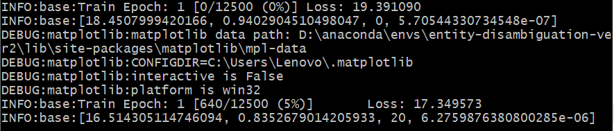
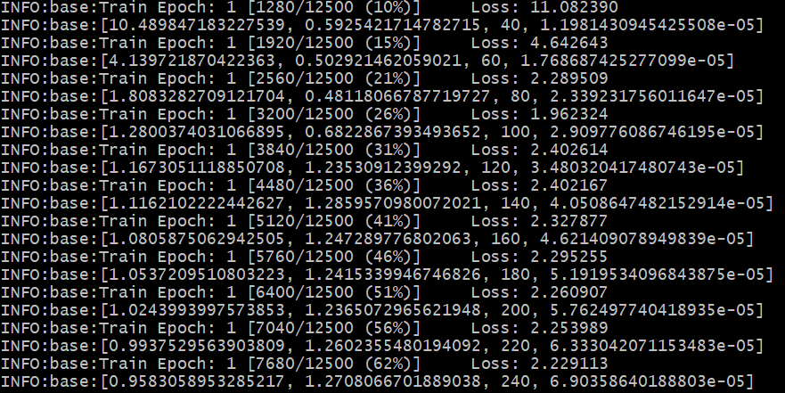
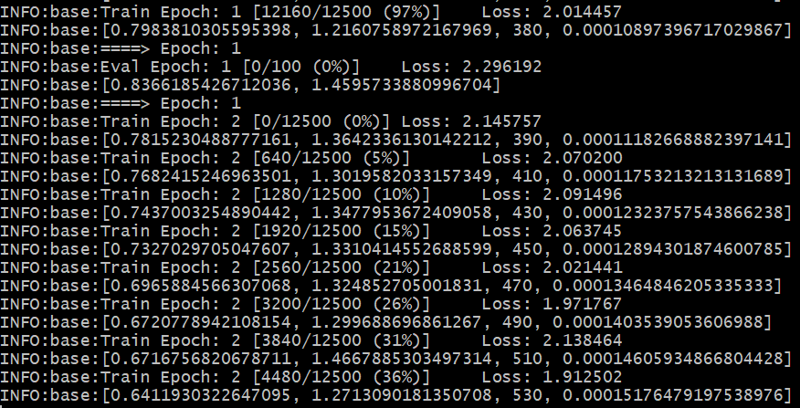
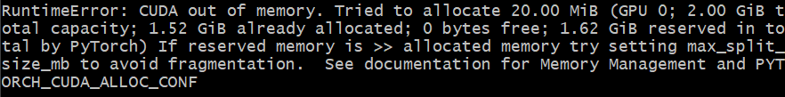

## Glow-TTS: A Generative Flow for Text-to-Speech via Monotonic Alignment Search
论文链接：https://arxiv.org/abs/2005.11129  
仓库链接：https://github.com/jaywalnut310/glow-tts?tab=readme-ov-file  

## 完成功能
&ensp;&ensp;完成了论文中的模型结构，并入talkingface框架中，实现了训练功能  

## 最终实现的训练
&ensp;&ensp;完成对LJ Speech数据集的训练
&ensp;&ensp;数据集下载链接：https://keithito.com/LJ-Speech-Dataset/

## 使用环境
&ensp;&ensp;因为原模型使用的依赖与talkingface框架中的依赖有冲突，在运行时存在问题，我们在构建时使用了原模型的依赖，详细可见environment.yml以及requirements.txt文件
   - Python3.6.9
   - pytorch1.2.0
   - cython0.29.12
   - librosa0.7.1
   - numpy1.16.4
   - scipy1.3.0

## 核心代码修改
   - glowTTS.dataset.py
      - 新建一个GlowTTSDataset类，让其继承于Dataset基类，用来处理数据集。在其__init__方法中将datasplit和config作为参数传给TextMelLoader类的实例化。实现的__getitem__用于获取数据集中特定索引的样本，在这里简单调用了TextMelLoader对象的__getitem__方法来实现这一目的，__len__方法返回数据集长度，同样简单调用了TextMelLoader对象的__len__。
      - 修改TextMelCollate类中的__call__方法，让其返回一个字典。
   - glowTTS.py
      - 修改原仓库model.py的FlowGenerator类，让其继承于AbstractTalkingFace基类，实现基类的calculate_loss、predict和generate_batch方法。主要介绍以下其中calculate_loss方法的实现逻：先从输入的interaction中提取出所需的四个参数以及generator模型，然后调用模型得到输出，然后调用commons模块的mle_loss和duration_loss方法，计算模型的loss，最后，返回一个字典，包含了总损失值loss_g和各项损失值的列表loss_gs。
   - quick_start.py 
      - 加入一个判断，如果config中的model是glowTTS，则在调用DataLoader创建训练数据加载器train_data_loader和验证数据加载器val_data_loader是将创建的TextMelCollate传入，用于批处理不同长度的文本和Mel谱特征序列，便于模型训练。
   - 配置文件
      - 修改LJSpeech.yaml中的train_filelist、val_filelist和data_root，注释数据预处理相关的配置信息。其他配置用原模型参数配置。
      - 修改glowTTS.yaml中checkpoint_sub_dir和temp_sub_dir。其他配置同原模型参数配置。
## 准备工作
   &emsp;&emsp;a) 下载并解压LJ Speech数据集，然后重命名或创建一个指向数据集文件夹的链接：
   `ln -s /path/to/LJSpeech-1.1/wavs DUMMY`
   
   &emsp;&emsp;b) 构建单调对齐搜索代码（Cython）：
   `cd monotonic_align; python setup.py build_ext --inplace`  
   &emsp;&emsp;此外，还需要在utils文件夹中的WaveGlow文件夹中下载预训练的WaveGlow模型，链接详见文件夹中md文件
   
   &emsp;&emsp;c) 若本机未搭建gpu环境或独显显存较小，则可以在代码中去掉与cuda相关的内容，同样可以完成训练，但速度较慢。
## 训练
   &emsp;&emsp;完成以上工作后运行训练脚本：
   ` python run_talkingface.py --model=glowTTS -–dataset=LJSpeech`
## 训练截图
  

## 遇到的问题与解决
   &emsp;&emsp;1.原代码中使用apex库加速混合精度训练，但由于该库的配置问题无法在本机使用，故更改为仅使用torch.nn中包含的DistributedDataParallel方法。
   
   &emsp;&emsp;2.在运行代码时出现爆显存的问题，如下图所示：

   
   
   &emsp;&emsp;通过调小原代码所提供的batch_size参数以及在一个epoch训练结束后添加清除显存代码解决该问题：
   
   &emsp;&emsp;`gc.collect()`

   &emsp;&emsp;`torch.cuda.empty_cache()`

   &emsp;&emsp;3.在整合时由于原代码中的参数设置有不合理的地方，例如epoch过大等，需要每一次训练后及时修改这些参数，使得训练时更加准确快速。

## 团队分工
骆奕帆：完成模型框架的大致整合，完善模型整体结构，对于需要修改的部分进行标注，共同完成相关文档编写

刘凇赫：完成数据的处理部分，进行模型的运行，给出模型训练结果，共同完成相关文档编写

邓斌：完成模型model部分的改写，整合model部分与talkingface框架，共同完成相关文档编写

