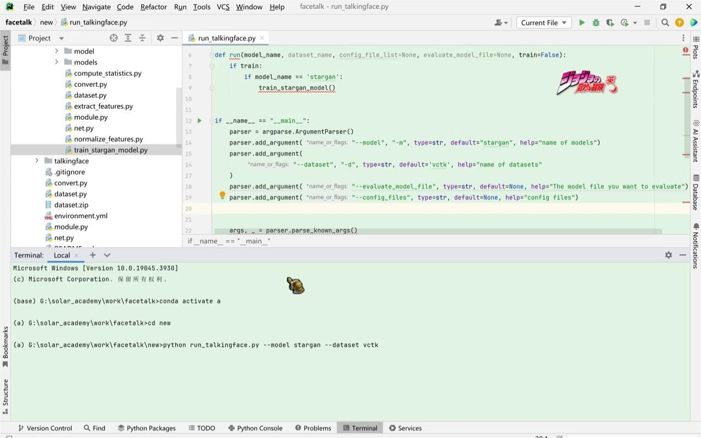
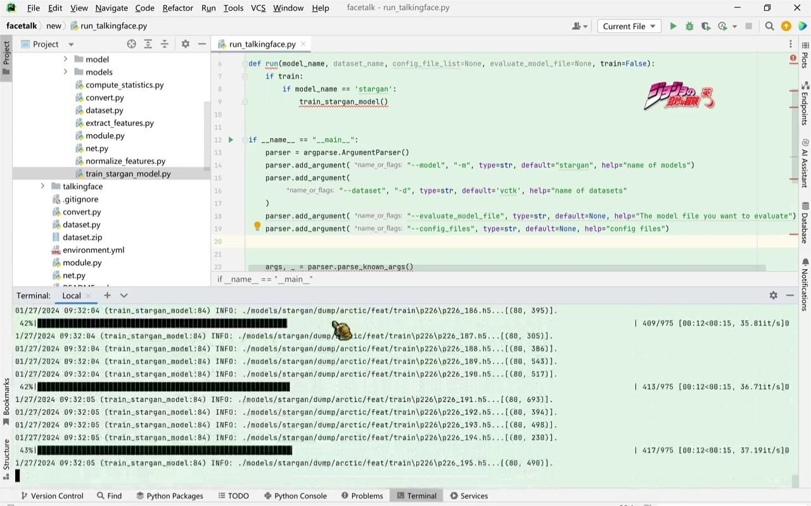
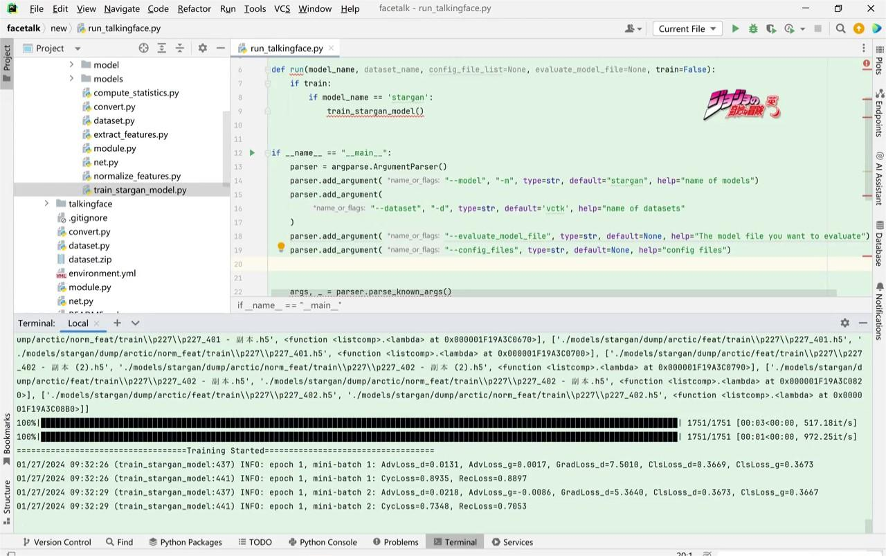
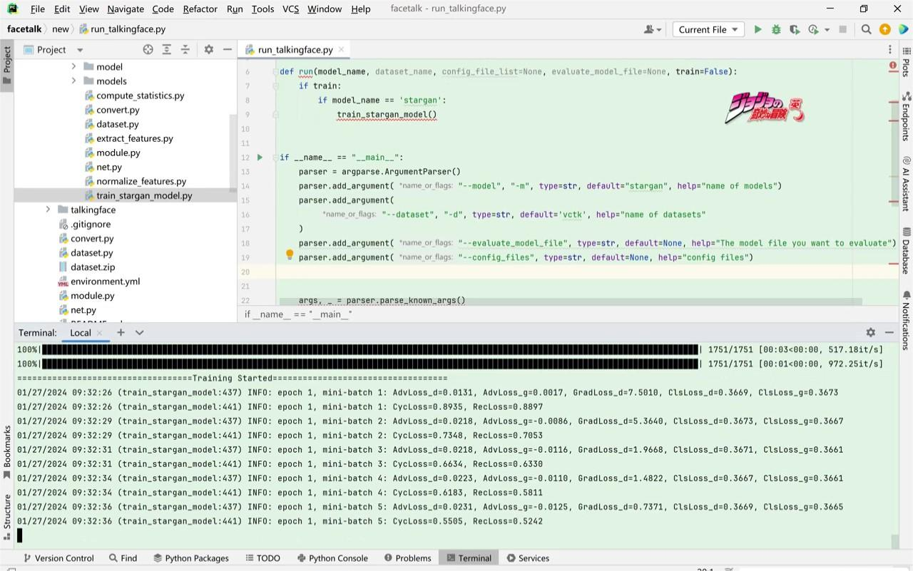

# talkingface-toolkit小组作业
小组成员名单:陈清扬 高艺芙 贺芳琪
# 模型选择：
我们选择复现的模型是StarGAN-VC模型，是专为语音转换任务设计的模型。它是StarGAN框架的延伸，该框架最初用于图像到图像的转换任务。StarGAN-VC专注于将一个说话者的语音特征转换为另一个说话者。
# 作业环境
# 数据集
# 运行说明
# 运行指令
# 实现功能
# 结果截图

# 所用依赖
# 成员分工（按任务先后顺序编写）
高艺芙-1120213132-07022102:负责配置好实验环境，准备实验数据，运行starGan模型，将得到配置文件json转换为yaml并整合到相应的文件结构中。

贺芳琪-1120210640-08012101:部分配置调整，主要负责data，数据预处理部分。
  将stargan-vc中的dataset.py、compute_statistics.py、extract_features.py、normalize_features.py中有关数据预处理的代码整合到talkingface-toolkit/talkingface/data的dataset和dataprocess文件夹中，并修改了talkingface-toolkit中yaml里面有关数据预处理的参数。
  划分数据集，按照80%、10%、10%的比例划分了三个数据集，生成了test.txt、train.txt、val.txt等文件，保存在dataset文件夹中。详细解释可见data部分的readme文件中。
  
陈清扬-1120213599-07112106:模型代码重构，训练代码重构，推理文件重构，配置文件调整，测试代码与bug修复，撰写实验报告

