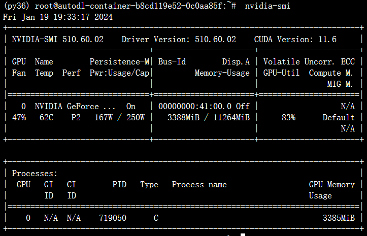
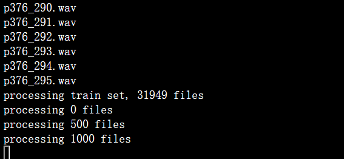
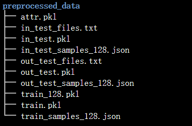
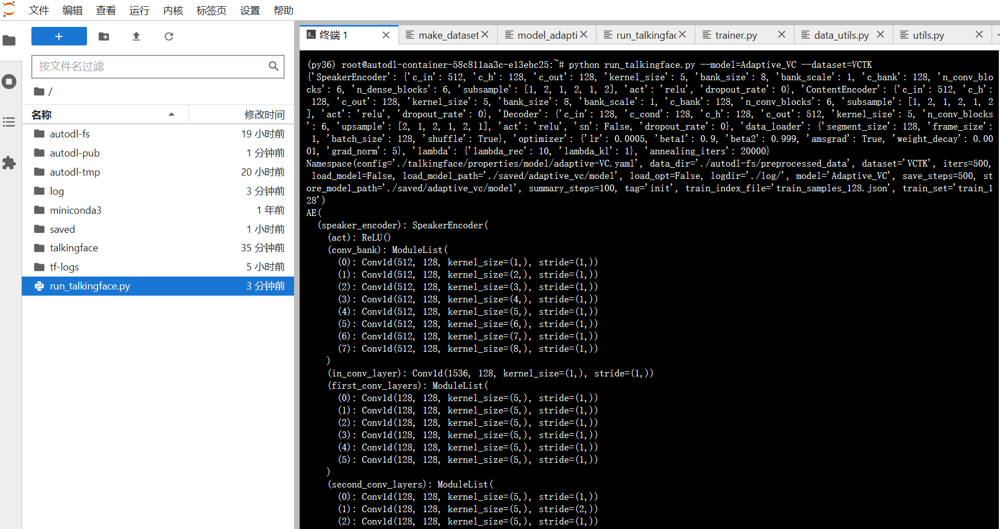
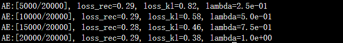
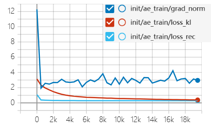

# Adaptive Voice Conversion

## Abstract

- 实验项目为voice_conversion类别下的adaptive-VC

- 项目由付宇轩1120213142个人完成
  - 重构代码地址：https://github.com/FFFXX0319/talkingface-toolkit.git
  - 源代码地址：https://github.com/jjery2243542/adaptive_voice_conversion.git

- 文档主要分为两个部分：
  - 代码结构介绍：对重构的代码结构进行介绍，并说明完成的工作
  - 实验步骤：说明实验流程，对模型训练、验证和推理的结果进行展示

## 代码结构介绍

### checkpoints                                                                                                                                               

- the pretrain model   

  http://speech.ee.ntu.edu.tw/~jjery2243542/resource/model/is19/vctk_model.ckpt

- the coresponding normalization parameters for inference 

  http://speech.ee.ntu.edu.tw/~jjery2243542/resource/model/is19/attr.pkl

### dataset

实验使用的数据集是CSTR VCTK Corpus数据集，可以在下面的地址中下载获得。

\-[CSTR VCTK Corpus](https://datashare.ed.ac.uk/handle/10283/3443)

在dataset文件夹中，VCTK-Corpus存放的是在网站下载的原始数据，preprocessed_data存放的是经过预处理之后的数据。

```python
dataset
├── preprocessed_data *
│   ├── attr.pkl
│   ├── in_test_files.txt
│   ├── in_test.pkl
│   ├── in_test_samples_128.json
│   ├── out_test_files.txt
│   ├── out_test.pkl
│   ├── out_test_samples_128.json
│   ├── train_128.pkl
│   ├── train.pkl
│   └── train_samples_128.json
├── VCTK-Corpus *
│   ├── COPYING
│   ├── NOTE
│   ├── README
│   ├── speaker-info.txt
│   ├── txt *
│   └── wav48 *
└── (*符号代表该路径名为文件夹)
```

### result

result文件夹存放了模型训练和验证的log文件，以及模型推理生成的语音wav文件。

```python
result
├── inference
│   ├── source.wav   
│   ├── target.wav
│   ├── output.wav
│   └── inference_output.log
└── train
    └── train_output.log
```

### saved

训练过程中保存的模型checkpoint, 训练过程中保存模型时自动创建。

```python
saved
└── adaptive_vc
    ├── vctk_model.args.yaml   # 训练生成的命令参数配置文件              
    ├── vctk_model.ckpt        # 训练后模型的checkpoint
    ├── vctk_model.config.yaml   # 训练生成的模型参数配置文件
    └── vctk_model.opt
```

### tf-logs

训练的日志文件，用于tensorboard绘制评估曲线。

### talkingface模块

模型的核心代码部分

#### config

根据模型和数据集名称自动生成所有模型、数据集、训练、评估等相关的配置信息。

#### data

```python
data
├── dataprocess   # 模型特有的数据处理代码
│   ├── __init__.py
│   ├── make_datasets_vctk.py
│   ├── preprocess_vctk.sh
│   ├── reduce_dataset.py
│   ├── sample_segments.py
│   ├── sample_single_segments.py
│   ├── tacotron
│   │   ├── hyperparams.py
│   │   └── utils.py
│   └── vctk.config
└── dataset
    ├── __init__.py
    ├── dataset.py
    └── vctk_dataset.py

```

- dataprocess：模型特有的数据处理代码，可以通过运行preprocess_vctk.sh脚本直接进行数据的处理。
- vctk_dataset.py:  创建SequenceDataset，PickleDataset子类，继承自基类Dataset，实现基类中的方法。
  - SequenceDataset子类用于处理数据存储在字典中，每个键对应一个完整的数据序列的情况。
  - PickleDataset子类用于处理数据存储在pickle文件中，需要根据样本索引截取数据段的情况。

#### model

- model_adaptive_VC.py：创建MLP，Prenet，SpeakerEncoder，ContentEncoder，Decoder，AE等子类，继承自基类AbstractTalkingFace。
  - MLP子类实现了一个多层感知机模型，具有输入层、多个块（每个块包含两个全连接层和激活函数），以及最后的输出层。在前向传播过程中，输入依次经过每个块，其中输出层的结果与隐藏层相加，形成更新后的隐藏层输出，最终返回更新后的隐藏层张量作为模型的输出。
  - Prenet类用于语音合成任务中的预处理阶段，将输入张量通过多个卷积块和跳跃连接的层，经过一系列的卷积、激活函数、实例归一化和dropout操作，最终输出一个经过1D卷积和激活函数处理的张量。
  - SpeakerEncoder和ContentEncoder都是语音编码模型，通过一系列的卷积和全连接操作，对语音信号进行特征提取和编码。其中SpeakerEncoder 子类是对说话人特征进行编码，ContentEncoder是对语音内容进行编码。
  - Decoder 类实现了一个解码器模型，用于将编码后的语音内容向量解码为语音信号。它接收一个表示语音内容的向量以及条件信息作为输入，并通过一系列的卷积、上采样和转换操作生成输出的语音信号。
  - AE类封装了一个能够对语音信号进行编码和解码的自编码器模型，通过 SpeakerEncoder 对说话人特征进行编码，通过 ContentEncoder 对语音内容进行编码，然后通过 Decoder 进行解码，生成重建的语音信号。

#### properties

- dataset：vctk.config     VCTK数据集配置文件
- model：adaptive-VC.yaml    adaptive-VC模型配置文件

#### utils

- data_utils.py：数据处理相关的工具类，与源代码一致。          
- utils.py：模型公用的工具类，包含训练设备获取、tensorboard日志文件等。

#### trainer

- trainer.py：在Trainer类中增添了一些用于模型训练的方法，如save_config、ae_step等。

#### evalutor

- evaluator.py：在Evaluator类中增添了一些用于模型推理的方法，如load_model、denormalize、normalize、write_wav_to_file等。

## 实验步骤

### 1. 环境搭建

- 硬件环境
  - CPU ：12 核心   内存：43 GB
  - GPU ：NVIDIA GeForce RTX 2080 Ti

实验在Autodl平台上进行模型的训练和评估，选择使用平台提供的miniconda3镜像，按照以下步骤搭建环境。

- **创建conda虚拟环境py36并激活环境**

  ```shell
  conda create -n py36 python=3.6
  conda init bash && source /root/.bashrc
  conda activate py36
  ```

- **查看显卡支持的最大cuda版本，选择合适的pytorch版本安装**

  ```assembly
  nvidia-smi
  ```

  

- **安装实验所用的第三方库**

  实验根据文档提出的环境要求进行了尝试，使用`python=3.8`，`torch==1.13.1+cu116`，`numpy==1.20.3`，`librosa==0.10.1`进行环境配置，但是在项目的复现中遇到了非常多的版本冲突。项目源码实现的环境使用了低于0.8.0版本的librosa，低于0.50.0版本的numba，使用文档要求的环境会引发一系列与numba\llvmlite\python包版本不兼容的问题，所以实验使用了较早版本的第三方库环境，具体的第三方库配置已导出到requirement.txt中。

  - torch=1.0.1  torchvision=0.2.2
  - numba=0.48.0
  - numpy=1.19.5
  - pip=21.3.1
  - SoundFile=0.10.2
  - librosa=0.7.2
  - llvmlite=0.31.0

### 2.数据预处理

对数据集进行预处理，将数据集划分为train_set、 in_test_set和out_test_set。

```bash
bash preprocess_vctk.sh
```



经过预处理后的数据架构如下：



### 3.模型训练和验证

使用run_talkingface.py进行模型的训练和验证

```
python run_talkingface.py --model=Adaptive_VC --dataset=VCTK
```

训练参数设置如下：

- **--model**, default="Adaptive_VC"
- **--dataset**, default="VCTK"

- **--config**,  default='./talkingface/properties/model/adaptive-VC.yaml'

- **--data_dir**, default='./autodl-fs/preprocessed_data'

- **--train_set**, default='train_128'

- **--train_index_file**,  default='train_samples_128.json'

- **--logdir**,  default='./tf-logs/'

- **--store_model_path**,  default='./saved/adaptive_vc/vctk_model'

- **--load_model_path**,  default='./saved/adaptive_vc/vctk_model'

- **--summary_steps**,  default=500

- **--save_steps**,  default=5000

- **--iters**,  default=20000

实验的训练结果输出在`result\train\train_output.log`，训练得到的模型在`saved\adaptive_vc\vctk_model.ckpt`。

模型训练过程的截图如下:



经过20000个iter的训练之后，得到的模型效果如下：





### 4.模型推理

使用run_inference.py进行模型的推理

```
python run_inference.py
```

模型推理的参设置如下：

- **-c**, the path of config file.
- **-m**:,the path of model checkpoint.
- **-a**, the attribute file for normalization ad denormalization.
- **-s**, the path of source file (.wav).
- **-t**, the path of target file (.wav).
- **-o**, the path of output converted file (.wav).

验证使用的模型为`saved/adaptive_vc/vctk_model.ckpt`，模型推理结果的输出在`result\inference\inference_output.log`，生成的语音在`result\inference\output.wav`。


