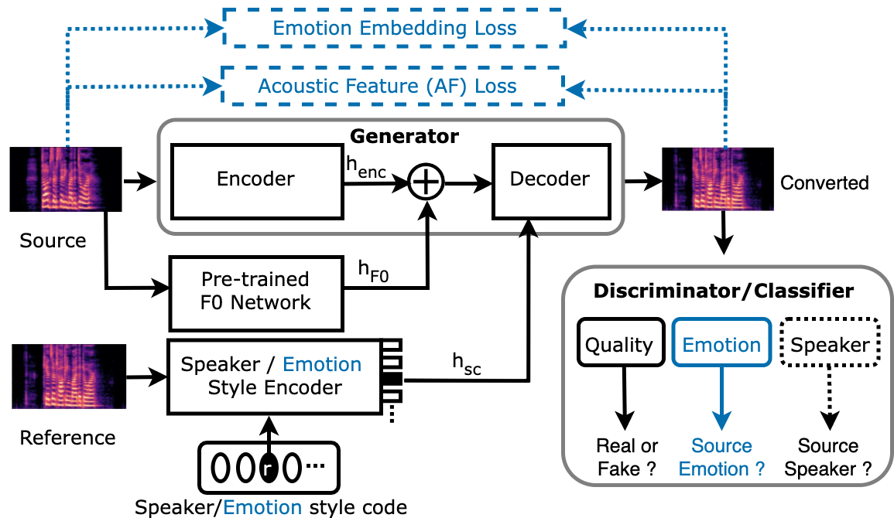

# Emo-StarGAN 
一种基于语音转换的情感保存深度半监督扬声器匿名方法

原论文链接：[https://arxiv.org/abs/2309.07586](https://arxiv.org/abs/2106.06103)





## 完成的功能

把Emo-Stargan的模型按照talkingface框架完成整合，实现训练功能并完成模型推理代码。


## 所使用的依赖

python>=3.9
以顺利配置onnx-graphsurgeon和uff，应安装`nvidia-pyindex==1.0.9`
通过下述指令配置环境
```bash
pip install -r requirements.txt
```

在windows环境下，tensorrt和triton无法在windows环境下直接下载，需要通过安装包的方法配置：
tensorrt安装方法参考：
[TensorRT(一)Windows+Anaconda配置TensorRT环境 (Python版 )_windows conda 安装tensorrt 8.6.0-CSDN博客](https://blog.csdn.net/JianguoChow/article/details/123926491)
triton安装方法参考：
[分析解决【No module named ‘triton‘】的问题_error caught was: no module named 'triton-CSDN博客](https://blog.csdn.net/ddrfan/article/details/130127401)

## 训练

#### 数据集准备
采用 [Centre for Speech Technology Voice Cloning Toolkit (VCTK)](https://datashare.ed.ac.uk/handle/10283/2950) 和 [Emotional Speech Dataset (ESD)](https://hltsingapore.github.io/ESD/) 数据集进行训练，包括不同口音、性别、情感和跨语料库转换。
在使用 VCTK 时需要使用`dataset/Preprocess/getdata.py`提前处理。`dataset/Data/train_list.txt` 和 `dataset/Data/val_list.txt` 中的对应路径也需要进行修改。

#### 加载权重
ASR, JDC, emotion embeddings 和  vocoder 的权重需要提前下载并放置在
`voice_conversion/Utils/ASR/epoch_00100.pth`
`voice_conversion/Utils/JDC/bst.t7`
`voice_conversion/Utils/emotion_encoder/emotion_style_encoder_pretrained_first_stage.pth` 
和 `voice_conversion/Utils/vocoder/checkpoint-2500000steps.pkl`

#### 训练
请在配置文件中修改 "num_speaker_domains "中的目标发言人数量以及其他细节。
```bash
python train.py --config_path ./voice_conversion/Configs/speaker_domain_config.yml
```

## 测试
```bash
python test_model.py
```
等待运行结束，结果会存放在`generated_data/`中

在不运行的情况下，可以通过EmoStarGAN Demo.ipynb文件观察效果

## 成员分工

-   刘廷汉：阅读源码和论文，配置环境，将源码迁移到talkingface-toolkit框架中，修改项目中的模型部分，编写并测试推理代码，共同完成文档生成。
-   刘玥：阅读源码和论文，配置环境，进行依赖管理，修改项目中的配置文件，观察项目在测试demo中的效果，共同完成文档生成。


原仓库链接：[[GitHub - suhitaghosh10/emo-stargan: Implementation of Emo-StarGAN](https://github.com/suhitaghosh10/emo-stargan)]


