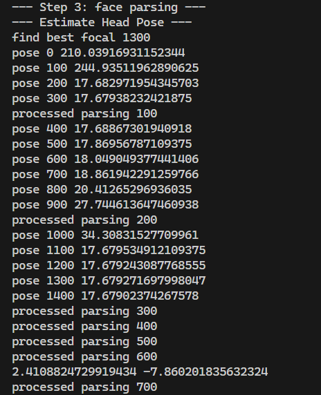
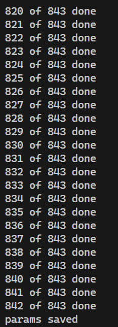
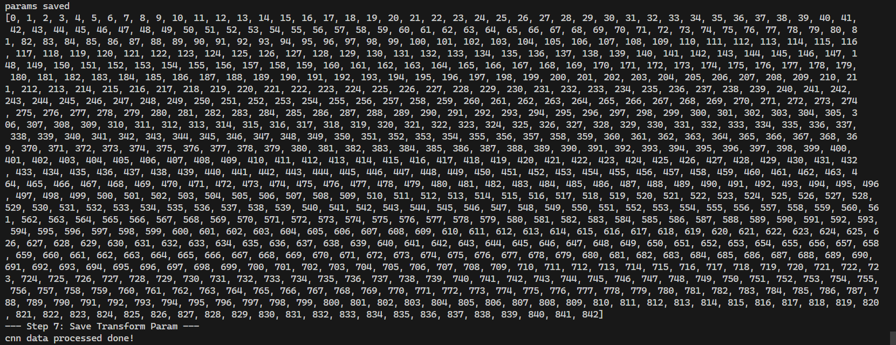
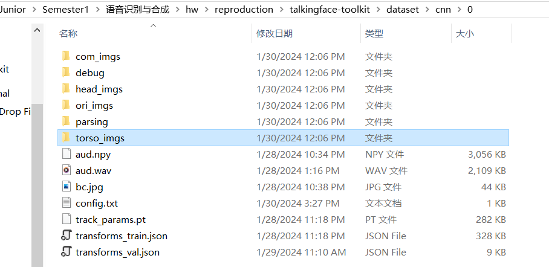
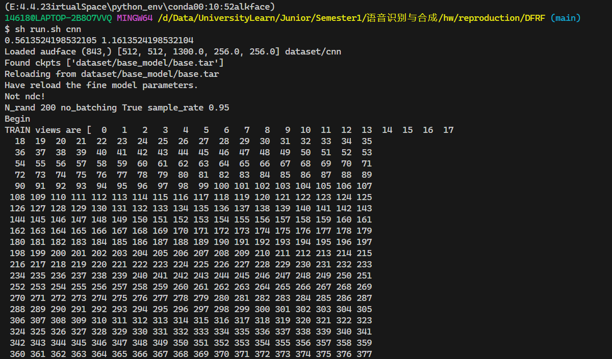
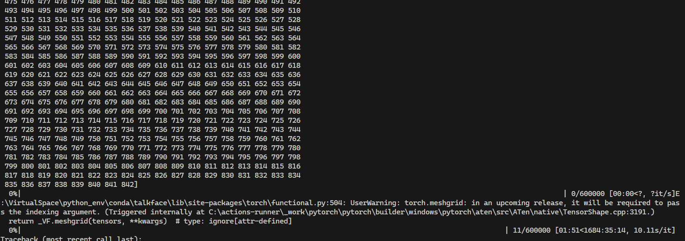
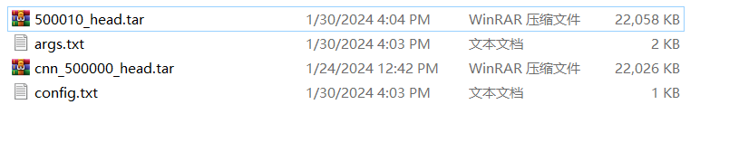
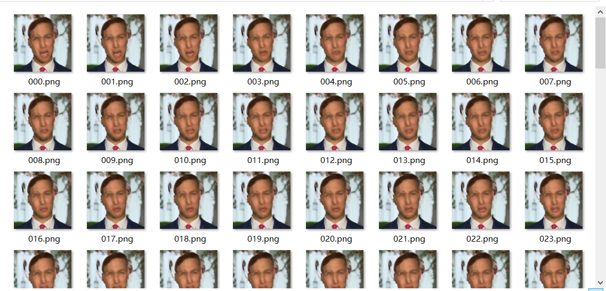
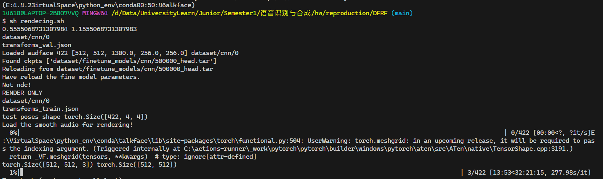

# DFRF复现重构工作文档

[TOC]

## 依赖环境说明

### 硬件环境

GPU: NVIDIA GeForce GTX1650

### 软件环境

#### 安装库所需的前置软件环境

运行平台：window10

cuda版本：11.6

cub版本：1.15.0

安装gitbush终端：运行命令是的环境需要是这个基于windows环境实现的虚拟linux终端接口，因为有数据预处理需要用到的命令调用需要在linux环境下才能调用到

配置电脑的虚拟内存>50GB，保证数据处理过程内存够用（由于本人电脑物理内存不满足条件，因此采用此设置，若有50GB的内存硬件则可以省去这一步）

本实验复现过程是以talkingface原本提供的requirements.txt文件配置的环境，以此为基础，再结合补全论文代码运行过程中报错缺省的库的方式配置完成的

### 改动的环境说明

1. librosa库在现有的库中不需要使用，论文复现需要的tensorflow-gpu对于numpy的版本要求是固定的1.19.5.而librosa0.10.0需要的numpy版本是1.20.0以上，导致环境不兼容，而在本次复现过程中librosa用不到，我们将使用的的lrs2Preprocess函数调用的地方删掉了，从而可以运行
2. 由于tensorflow版本的限制，protobuf所需的版本也要下调至3.19.0
3. 还有一些其他的库在配置缺省库的过程中pip自行进行了更新，但并未报错，因此不再赘述，具体结果按照下述文件进行配置即可

### 最终环境信息

请确保满足了上述硬件和软件的基础环境配置，再使用下述内容进行配置

#### conda配置文件

```yaml
name: talkface
channels:
  - <unknown>
  - conda-forge
  - https://mirrors.tuna.tsinghua.edu.cn/anaconda/cloud/conda-forge
  - defaults
dependencies:
  - bzip2=1.0.8=hcfcfb64_5
  - ca-certificates=2023.11.17=h56e8100_0
  - libffi=3.4.2=h8ffe710_5
  - libsqlite=3.44.2=hcfcfb64_0
  - libzlib=1.2.13=hcfcfb64_5
  - openssl=3.2.0=hcfcfb64_1
  - pip=23.3.2=pyhd8ed1ab_0
  - python=3.8.18=h4de0772_1_cpython
  - setuptools=57.4.0=py38haa244fe_2
  - tk=8.6.13=h5226925_1
  - ucrt=10.0.22621.0=h57928b3_0
  - vc=14.3=hcf57466_18
  - vc14_runtime=14.38.33130=h82b7239_18
  - vs2015_runtime=14.38.33130=hcb4865c_18
  - wheel=0.42.0=pyhd8ed1ab_0
  - xz=5.2.6=h8d14728_0
  - pip:
      - absl-py==0.15.0
      - addict==2.4.0
      - aiosignal==1.3.1
      - appdirs==1.4.4
      - astunparse==1.6.3
      - attrs==23.1.0
      - audioread==3.0.1
      - cachetools==4.2.4
      - certifi==2020.12.5
      - cffi==1.16.0
      - charset-normalizer==3.3.2
      - clang==5.0
      - click==8.1.7
      - cloudpickle==3.0.0
      - colorama==0.4.6
      - colorlog==6.7.0
      - configargparse==1.5.2
      - contourpy==1.1.1
      - cycler==0.12.1
      - decorator==5.1.1
      - docker-pycreds==0.4.0
      - face-alignment==1.3.5
      - ffmpeg==1.4
      - filelock==3.13.1
      - flatbuffers==1.12
      - fonttools==4.44.0
      - frozenlist==1.4.0
      - future==0.18.3
      - fvcore==0.1.5.post20210915
      - gast==0.4.0
      - gitdb==4.0.11
      - gitpython==3.1.40
      - glob2==0.7
      - google-auth==1.35.0
      - google-auth-oauthlib==0.4.6
      - google-pasta==0.2.0
      - grpcio==1.60.0
      - h5py==3.1.0
      - hyperopt==0.2.5
      - idna==3.4
      - imageio==2.9.0
      - imageio-ffmpeg==0.4.5
      - importlib-metadata==6.8.0
      - importlib-resources==6.1.0
      - iopath==0.1.9
      - joblib==1.3.2
      - jsonschema==4.19.2
      - jsonschema-specifications==2023.7.1
      - keras==2.13.1
      - keras-preprocessing==1.1.2
      - kiwisolver==1.4.5
      - lazy-loader==0.3
      - libclang==16.0.6
      - librosa==0.10.1
      - llvmlite==0.37.0
      - lmdb==1.2.1
      - markdown==3.5.1
      - markupsafe==2.1.3
      - matplotlib==3.6.3
      - msgpack==1.0.7
      - natsort==7.1.1
      - networkx==3.1
      - numba==0.54.1
      - numpy==1.19.5
      - oauthlib==3.2.2
      - opencv-python==3.4.9.33
      - opt-einsum==3.3.0
      - packaging==23.2
      - pandas==1.3.4
      - pathtools==0.1.2
      - pillow==6.2.1
      - pkgutil-resolve-name==1.3.10
      - platformdirs==3.11.0
      - plotly==5.18.0
      - pooch==1.8.0
      - portalocker==2.8.2
      - protobuf==3.19.0
      - psutil==5.9.6
      - pyasn1==0.5.0
      - pyasn1-modules==0.3.0
      - pycparser==2.21
      - pyparsing==3.1.1
      - python-dateutil==2.8.2
      - python-speech-features==0.6
      - pytorch-fid==0.3.0
      - pytorch3d==0.7.3
      - pytz==2023.3.post1
      - pywavelets==1.4.1
      - pywin32==306
      - pyyaml==5.3.1
      - ray==2.6.3
      - referencing==0.30.2
      - requests==2.31.0
      - requests-oauthlib==1.3.1
      - resampy==0.2.2
      - rpds-py==0.12.0
      - rsa==4.9
      - scikit-image==0.16.2
      - scikit-learn==1.3.2
      - scipy==1.5.0
      - sentry-sdk==1.34.0
      - setproctitle==1.3.3
      - six==1.15.0
      - smmap==5.0.1
      - soundfile==0.12.1
      - soxr==0.3.7
      - tabulate==0.9.0
      - tenacity==8.2.3
      - tensorboard==2.6.0
      - tensorboard-data-server==0.6.1
      - tensorboard-plugin-wit==1.8.1
      - tensorflow-estimator==2.15.0
      - tensorflow-gpu==2.6.0
      - tensorflow-io-gcs-filesystem==0.31.0
      - termcolor==1.1.0
      - texttable==1.7.0
      - thop==0.1.1-2209072238
      - threadpoolctl==3.2.0
      - tomli==2.0.1
      - torch==1.13.1+cu116
      - torchaudio==0.13.1+cu116
      - torchvision==0.14.1+cu116
      - tqdm==4.66.1
      - trimesh==3.9.20
      - typing-extensions==3.7.4.3
      - tzdata==2023.3
      - urllib3==2.0.7
      - wandb==0.15.12
      - werkzeug==3.0.1
      - wrapt==1.12.1
      - yacs==0.1.8
      - yapf==0.40.2
      - zipp==3.17.0
prefix: E:\VirtualSpace\python_env\conda\talkface
```

#### requirement配置文件

```txt
absl-py==0.15.0
addict==2.4.0
aiosignal==1.3.1
appdirs==1.4.4
astunparse==1.6.3
attrs==23.1.0
audioread==3.0.1
cachetools==4.2.4
certifi==2020.12.5
cffi==1.16.0
charset-normalizer==3.3.2
clang==5.0
click==8.1.7
cloudpickle==3.0.0
colorama==0.4.6
colorlog==6.7.0
ConfigArgParse==1.5.2
contourpy==1.1.1
cycler==0.12.1
decorator==5.1.1
docker-pycreds==0.4.0
face-alignment==1.3.5
ffmpeg==1.4
filelock==3.13.1
flatbuffers==1.12
fonttools==4.44.0
frozenlist==1.4.0
future==0.18.3
fvcore==0.1.5.post20210915
gast==0.4.0
gitdb==4.0.11
GitPython==3.1.40
glob2==0.7
google-auth==1.35.0
google-auth-oauthlib==0.4.6
google-pasta==0.2.0
grpcio==1.60.0
h5py==3.1.0
hyperopt==0.2.5
idna==3.4
imageio==2.9.0
imageio-ffmpeg==0.4.5
importlib-metadata==6.8.0
importlib-resources==6.1.0
iopath==0.1.9
joblib==1.3.2
jsonschema==4.19.2
jsonschema-specifications==2023.7.1
keras==2.13.1
Keras-Preprocessing==1.1.2
kiwisolver==1.4.5
lazy_loader==0.3
libclang==16.0.6
librosa==0.10.1
llvmlite==0.37.0
lmdb==1.2.1
Markdown==3.5.1
MarkupSafe==2.1.3
matplotlib==3.6.3
msgpack==1.0.7
natsort==7.1.1
networkx==3.1
numba==0.54.1
numpy==1.19.5
oauthlib==3.2.2
opencv-python==3.4.9.33
opt-einsum==3.3.0
packaging==23.2
pandas==1.3.4
pathtools==0.1.2
Pillow==6.2.1
pkgutil_resolve_name==1.3.10
platformdirs==3.11.0
plotly==5.18.0
pooch==1.8.0
portalocker==2.8.2
protobuf==3.19.0
psutil==5.9.6
pyasn1==0.5.0
pyasn1-modules==0.3.0
pycparser==2.21
pyparsing==3.1.1
python-dateutil==2.8.2
python_speech_features==0.6
pytorch-fid==0.3.0
pytorch3d==0.7.3
pytz==2023.3.post1
PyWavelets==1.4.1
pywin32==306
PyYAML==5.3.1
ray==2.6.3
referencing==0.30.2
requests==2.31.0
requests-oauthlib==1.3.1
resampy==0.2.2
rpds-py==0.12.0
rsa==4.9
scikit-image==0.16.2
scikit-learn==1.3.2
scipy==1.5.0
sentry-sdk==1.34.0
setproctitle==1.3.3
six==1.15.0
smmap==5.0.1
soundfile==0.12.1
soxr==0.3.7
tabulate==0.9.0
tenacity==8.2.3
tensorboard==2.6.0
tensorboard-data-server==0.6.1
tensorboard-plugin-wit==1.8.1
tensorflow-estimator==2.15.0
tensorflow-gpu==2.6.0
tensorflow-io-gcs-filesystem==0.31.0
termcolor==1.1.0
texttable==1.7.0
thop==0.1.1.post2209072238
threadpoolctl==3.2.0
tomli==2.0.1
torch @ file:///D:/Data/UniversityLearn/Junior/Semester1/%E8%AF%AD%E9%9F%B3%E8%AF%86%E5%88%AB%E4%B8%8E%E5%90%88%E6%88%90/hw/reproduction/DFRF/torch-1.13.1%2Bcu116-cp38-cp38-win_amd64.whl#sha256=1c33942d411d4dee25e56755cfd09538f53a497a6f0453d54ce96a5ca341627b
torchaudio @ file:///D:/download/%E6%B7%B1%E5%BA%A6%E5%AD%A6%E4%B9%A0%E5%AE%89%E8%A3%85%E5%8C%85%E8%B5%84%E6%BA%90/pip/torchaudio-0.13.1%2Bcu116-cp38-cp38-win_amd64.whl#sha256=d06bbfb5fc285e7522ed3284476fe4c630b03a15995d556c116be76d57e06ea6
torchvision @ file:///D:/download/%E6%B7%B1%E5%BA%A6%E5%AD%A6%E4%B9%A0%E5%AE%89%E8%A3%85%E5%8C%85%E8%B5%84%E6%BA%90/pip/torchvision-0.14.1%2Bcu116-cp38-cp38-win_amd64.whl#sha256=fefa6bee4c3019723320c6e554e400d6781ccecce99c1772a165efd0696b3462
tqdm==4.66.1
trimesh==3.9.20
typing-extensions==3.7.4.3
tzdata==2023.3
urllib3==2.0.7
wandb==0.15.12
Werkzeug==3.0.1
wrapt==1.12.1
yacs==0.1.8
yapf==0.40.2
zipp==3.17.0
```

## 完成的功能

这篇文章提出了一种用于小样本谈话人脸合成的动态人脸辐射场，使用音频信号耦合3D感知图像特征作为条件来快速泛化至新的身份。为了更好地建模嘴部动作，进一步学习了一个基于音频条件的人脸变形模块，将所有的参考图像变形至查询空间。大量实验表明该方法在有限的训练数据和迭代次数下生成自然谈话人脸的优越性。

### 原论文代码功能

1. 从一个视频中提取出训练所需的数据，以及从3D模型中提取所需的面部特征数据的数据预处理部分，这个视频的名称就是数据集的名称，在本人复现过程中使用了作者提供的cnn.mp4作为数据集，所以数据集名称即为cnn
2. 训练模型部分代码，但是散装的，并没有按照Dataset、Model、Trainer进行解耦
3. 使用模型渲染出最终的视频结果

### 实现的功能

总结来看实现了使用框架完成dfrf模型从数据准备到训练以及评估方法

#### 重构函数说明

##### 数据预处理模块重构

将对数据集的预处理重构进`talkingface`框架，在`talkingface/utils/utils/data_process.py`文件中实现了`cnnPreprocess`类，在此类中实现了`run()`方法，从而实现了对数据的预处理过程，在本实验中也就是产生训练模型需要的所有具体的数据以及配置文件

##### Dataset模块重构

在dfrf_dataset.py文件中的`dfrfDataset`实现类中实现，这个类通过调用源代码中提供的加载函数`load_audface_data`加载数据实现

##### dfrf模型重构

dfrf.py文件中`dfrf`类即使模型类，这个模型类继承基类`AbstractTalkingFace`，实现下面方法

```python
def __init__(self, config)
def calculate_loss(self, rgb, target_s, loss_translation, extras)
def forward(self, i)
def predict(self)
def generate_batch(self)
```

具体的实现方法是从源代码中的继承训练中抽出每一个循环要做的步骤实现的

##### dfrfTrianer训练器重构

由于dfrf模型是调用了很多网络拼凑而成的，并且训练过程中设计到很多参数的选择，因此训练器直接选择继承`Trainer`基类后重写最终调用的`fit()`方法从而直接实现训练过程

#### 数据预处理使用说明

在数据处理之前需要下载一些3D模型数据Download 3DMM model from [Basel Face Model 2009](https://faces.dmi.unibas.ch/bfm/main.php?nav=1-1-0&id=details):并执行下面命令，生成训练所需的3D数据

````shell
cp 01_MorphableModel.mat talkingface\data\dataprocess\DFRD_process_helper\face_tracking\3DMM
cd talkingface\data\dataprocess\DFRD_process_helper\face_tracking
python convert_BFM.py
````

完成这个数据准备后即可直接运行

```shell
python run_talkingface.py --model=dfrf --dataset=cnn
```

除了上面的3D数据，还需要视频数据作为基础数据，用来生成具体训练是需要的数据，这部分数据由于只有一个视频，因此直接放在了`dataset\cnn\data\cnn.mp4`方便训练

还有训练过程中使用的预训练模型`cnn_500000_head.tar`放在了`checkpoints`文件夹下，对应的配置文件和参数文件也已经提供了

因为在配置文件中已经用参数开启了数据预处理功能，因此直接运行即可完成数据预处理，预处理完的文件都放在了`dataset\cnn\0`文件夹下，最终会生成如下目录结构的文件

```
.
└── 0
	├── aud.npy
	├── aud.wav
	├── bc.jpg
    ├── com_imgs
    ├── debug
    │   └── debug_render
    ├── head_imgs
    ├── ori_imgs
    ├── parsing
    ├── torso_imgs
    ├── track_params.pt
	├── transforms_train.json
	└── transforms_val.json
```

对应文件夹中的图片样式范例如下：

**com_imgs**


**debug_render**


**head_imgs**


ori_imgs


以及对应的lms文件

**parsing**


**torso_imgs**


#### 训练说明

做好了上述数据预处理过程后，训练会在数据准备完成后自动开始，不需要做其他操作

#### 评估说明

评估方法由于在原文代码中紧耦合，且只有一行代码直接在训练过程中进行了打印输出，因此没有专门实现评估方法，在训练过程中即可看到PSNR指数

## 最终实现的训练以及验证截图

### 数据预处理



数据处理结果输出，成功完成了7个步骤的数据预处理工作





可以看到所有预处理的数据都被保存了，具体的结果文件如下：



### 训练

训练脚本运行成功示意图如下



进度条截图：需要600000个迭代，由于时间过长，本人预估需要训练63天时间训练，因此无法展示结果，仅说明该代码在本人复现过程中是成功的，可以看到已经完成了11个迭代



因此为了确保能得到训练结果，我将迭代次数设置为了500010次，从提供的500000次迭代预训练模型开始训练，得到下面结果模型



### 渲染结果

由于计算资源和时间有限，因此通过使用作者提供好的500000次迭代的cnn预训练模型作为基础，加上本人在本地的10次迭代计算，从而验证实现了训练功能，最终使用此模型给出的渲染结果如下，渲染合成的结果视频我放在了`saved/dfrf/render_output.mp4`，可以直接查看结果<video src="saved/dfrf/render_output.mp4"></video>



这是渲染一张图结果的输出结果，可以看到进度条正常在进展，但是由于渲染一张图片需要277s,也就是快5mins，等待所有的图片都渲染出来，需要35h，这个时间过长，因此没有跑出所有的图片结果，跑了100帧合成了一个视



## 成员分工

所有工作均有介应奇完成
