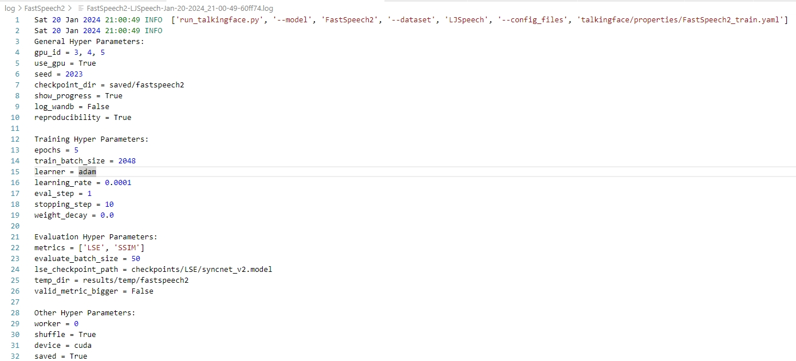
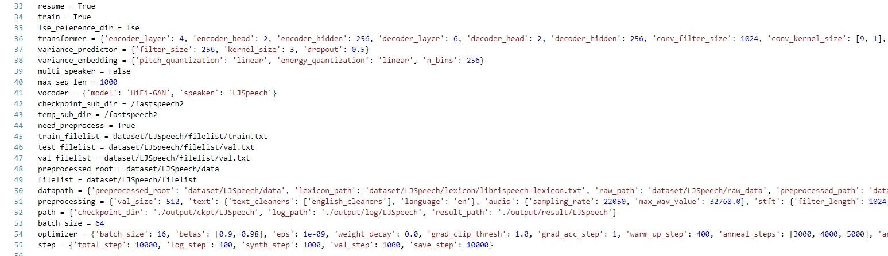
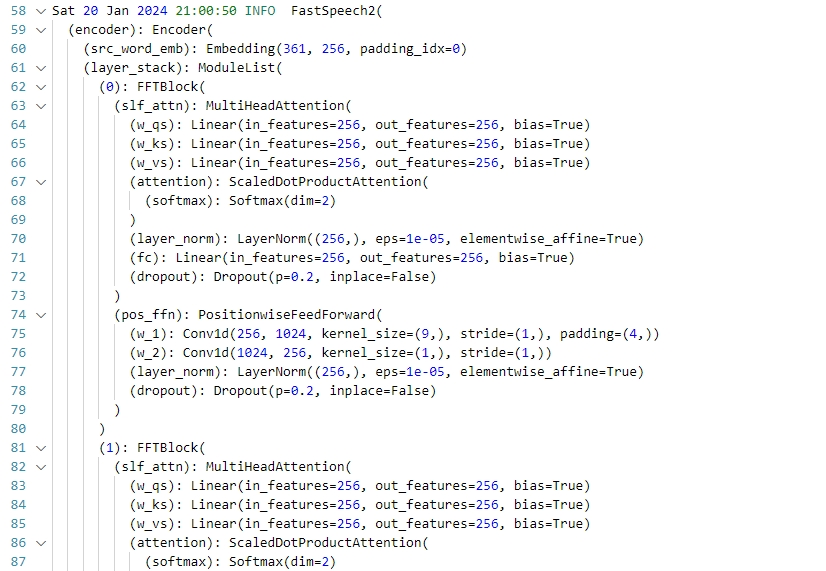
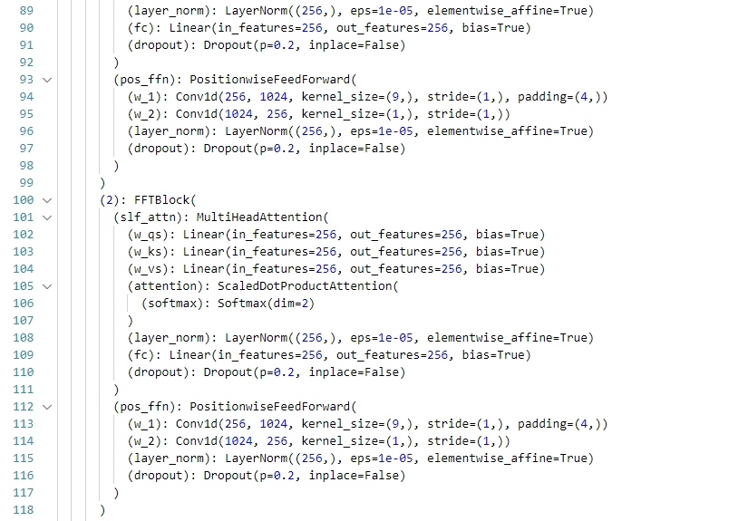
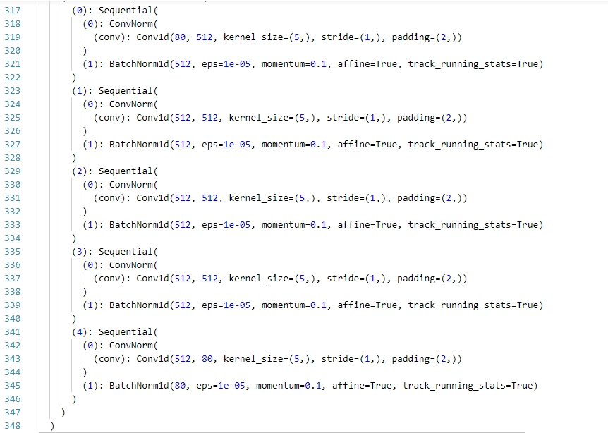
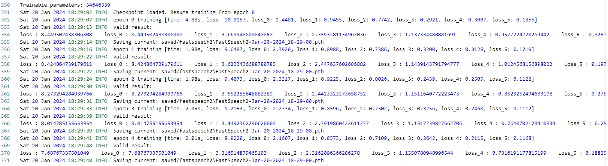
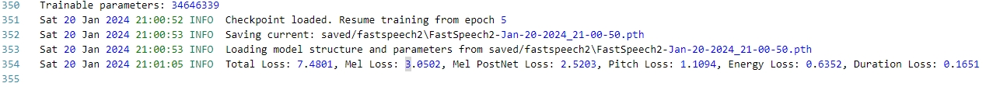

# talkingface_FastSpeech2

### checkpoints:

* HiFi-GAN.json: FastSpeech2 vocoder模型配置
* generator_LJSpeech.pth.tar:HiFi-GAN模型参数文件

### datset:

* LJSpeech数据集：
  * data：存放元数据
  * filelist：数据集划分及部分辅助参数文件
  * lexicon：音素表示文件库
  * raw_data：初预处理数据
  * preprocessed_data：预处理完成数据（duration，energy，mel，pitch等FastSpeech2使用的不同维度数据信息，TextGrid：MFA对齐工具）

### saved：

* fastspeech2：FastSpeech2的参数文件

### talkingface：

#### config

#### data

* dataset
  * fastspeech2_dataset.py：定义FastSpeech2Dataset类

#### evaluate

#### model：

* text_to_speech：
  * fastspeech2.py：FastSpeech2模型类，继承AbstractTalkingFace类

#### properties：

* dataset
  * LJSpeech.yaml：LJSpeech数据集配置文件
* model
  * FastSpeech2.yaml：FastSpeech2模型配置文件

FastSpeech2_train.yaml：FastSpeech2训练文件

#### quick_start

quick_start.py：关于dataloder部分做了简单修改，修改如下：


```python
    train_data_loader = data_utils.DataLoader(
        train_dataset, batch_size=config["batch_size"], shuffle=True, collate_fn=train_dataset.collate_fn
    )
    val_data_loader = data_utils.DataLoader(
        val_dataset, batch_size=config["batch_size"], shuffle=False, collate_fn=val_dataset.collate_fn
    )
```

添加了collate_fn参数

#### trainer

FastSpeech2Trainer.py：

* FastSpeech2Trainer：
  * 添加get_model函数：获取加载权重文件的model和optimizer，因为本模型optimizer不是简单的Adam，故自定义此接口获取optimizer，并独立创建ScheduledOptim类
  * 添加get_vocoder函数
  * 重写_train_epoch，_valid_epoch
  * 重写_save_checkpoint："optimizer": self.optimizer._optimizer.state_dict()
  * 重写evaluate函数，因为此模型属于TTS类，不能使用框架所给Evaluate方法，又希望能完整的迁移，故自写evaluate函数，完成Evaluate部分内容
* FastSpeech2Loss：FastSpeech2损失函数类
* ScheduledOptim：FastSpeech2优化器类

#### utils

audio：处理mel图工具包
fastspeech2_transformerblock：fastspeech2模型自定义块（varianceadaptor），vocoder块框架

text：fastspeech2处理文字包

data_process.py：添加LJSpeechPreprocess类，预处理LJSpeech数据集

### 使用方法

#### 环境要求

```python
g2p-en == 2.1.0
inflect == 4.1.0
librosa == 0.7.2
matplotlib == 3.2.2
numba == 0.48
numpy == 1.19.0
pypinyin==0.39.0
pyworld == 0.2.10
PyYAML==5.4.1
scikit-learn==0.23.2
scipy == 1.5.0
soundfile==0.10.3.post1
tensorboard == 2.2.2
tgt == 1.4.4
torch == 1.7.0
tqdm==4.46.1
unidecode == 1.1.1
```

#### 训练和评估

```
python run_talkingface.py --model FastSpeech2 --dataset LJSpeech --config_files "talkingface/properties/FastSpeech2_train.yaml"
```


运行结果：
参数：






模型：







无加载训练+验证：



加载训练+验证+评估：



### 权重文件：

- [LJSpeech](https://keithito.com/LJ-Speech-Dataset/): a single-speaker English dataset consists of 13100 short audio clips of a female speaker reading passages from 7 non-fiction books, approximately 24 hours in total.You have to unzip the files in`talkingface-toolkit/dataset/LJSpeech/data"`
-  MFA：Alignments of the supported datasets are provided [here](https://drive.google.com/drive/folders/1DBRkALpPd6FL9gjHMmMEdHODmkgNIIK4?usp=sharing). You have to unzip the files in `talkingface-toolkit/dataset/LJSpeech/preprocessed_data/TextGrid/`

