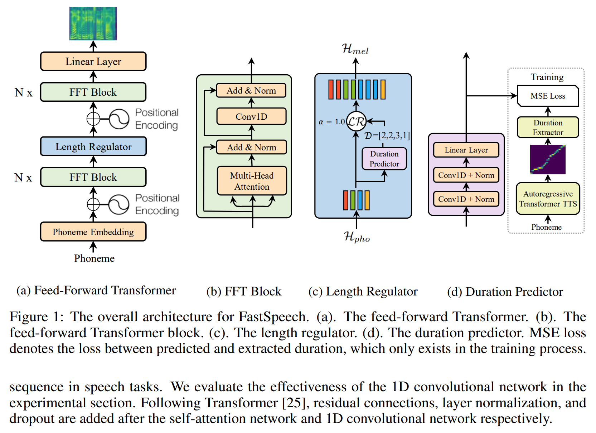
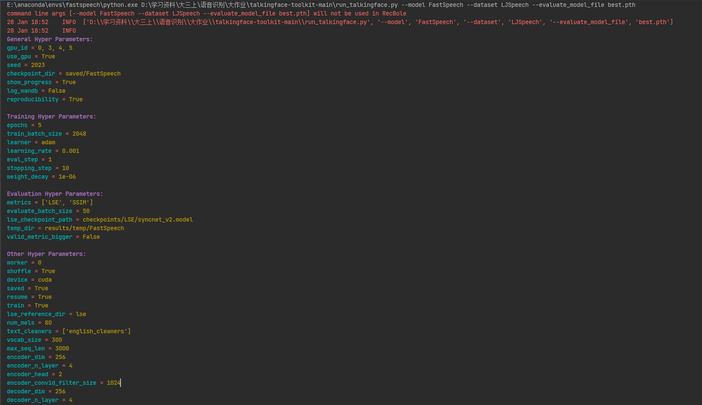
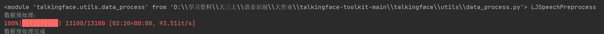
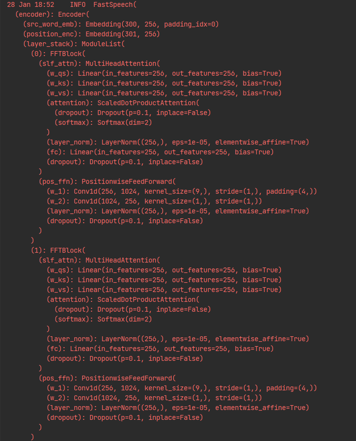
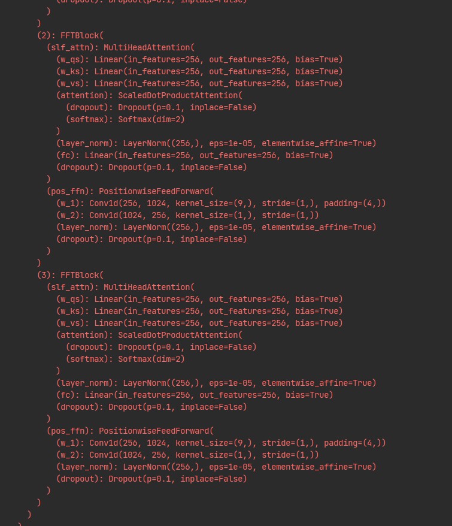
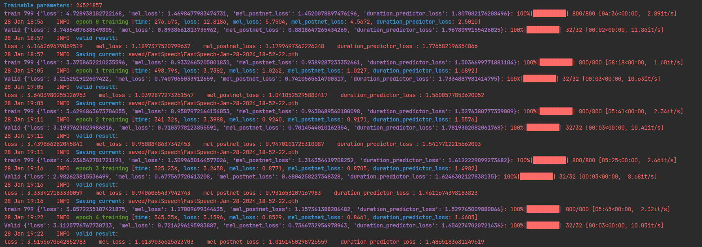

# FASTSPEECH
- 洪耀森 1120213563

## 目录
- [环境配置](#环境配置)  
- [数据集](#数据集dataset)  
- [预训练权重](#预训练权重checkpoints)  
- [主要模块](#主要功能模块talkingface)
  - [数据加载](#数据获取data)  
  - [模型定义](#模型定义model) 
  - [训练器定义](#训练器trainer)
  - [其他组件](#其他组件utils)
- [评估和训练](#评估和训练) 
- [运行截图](#运行截图)
- [使用方法](#使用方法)


## 环境配置
- python=3.8
- torch==1.13.1+cu116
- numpy==1.20.3
- librosa==0.10.1
- tqdm==4.66.1
- numba==0.54.1
- scipy==1.5.0
- opencv-python==3.4.9.33
- python-speech-features==0.6
- lws==1.2.7
- scikit-image==0.16.2
- ray==2.6.3
- tensorboard==2.7.0
- pandas==1.3.4
- colorlog==6.7.0
- texttable==1.7.0
- thop==0.1.1.post2209072238
- <font color=Red>**inflect==0.2.5**</font>
- <font color=Red>**unidecode==1.3.8**</font>

注：在项目框架原有的环境配置下，还需额外安装inflect和unidecode库。


## 数据集（dataset）
### LJSpeech: 
- 下载地址： [LJSpeech dataset](https://keithito.com/LJ-Speech-Dataset/)
- 数据集简介：
单一说话者的小型英语数据集，由13100个女性说话者阅读7本非小说类书籍段落的音频短片组成，总总时长约24小时

- 数据分割：

| 数据类型 | 对应语音编码 |
| :-----| ----: |
| train | 1-12500 |
| val | 12501-12800 |
| test | 12801-13100 |


## 预训练权重（checkpoints）
- 下载地址：[Tacotron2](https://drive.google.com/file/d/1WsibBTsuRg_SF2Z6L6NFRTT-NjEy1oTx/view)

- 主要功能：包含Tacotron2预训练模型，用于完成文本和语音之间的对齐工作，告诉模型如何将输入的文本序列映射到相应的语音输出序列。

## 主要功能模块（talkingface）
### 数据获取（data）
主要功能：定义FastSpeechDataset类，用于加载数据集

实现思路：定义get_data_to_buffer 方法，使用 text_to_sequence 函数将文本转换为整数序列，并将文本、梅尔频谱和持续时间信息转换为 PyTorch 张量。重写__getitem__，通过索引返回对应的数据样本。
collate_fn 方法用于将一个 batch 的数据处理成模型可接受的格式。它对每个样本的文本长度进行排序，然后分成多个子 batch，并调用 reprocess_tensor 函数处理每个子 batch。

### 模型定义（model）
主要功能：
- 定义模型网络
- 实现loss计算
- 实现预测和音频生成功能

主要网络结构：

实现思路：模型继承AbstractTalkingFace基类，完成模型定义后，重写calculate_loss，predict和generate_batch等方法。其中generate_batch用于评估，通过输入的文本输出对应音频


### 训练器（trainer）
因FastSpeech模型使用了自定义的优化器ScheduledOptim，所以需要继承Trainer基类，重写_build_optimizer，_train_epoch等方法。

### 其他组件（utils）
添加了以下组件：
- audio：音频处理组件
- text：文本处理组件
- fastspeech_transformer：fastspeech用到的transformer网络  

在data_process.py中添加了LJSpeechPreprocess类，重写run方法，实现数据预处理。  

## 评估和训练
```
run_talkingface.py --model FastSpeech --dataset LJSpeech (--other_parameters=xxxxxx)
```
## 运行截图
开始运行：
 
数据预处理：
 
网络结构：
 
 
训练+验证+保存模型：
 
模型加载+预测：


## 使用方法：
1. 下载数据集[LJSpeech dataset](https://keithito.com/LJ-Speech-Dataset/)，解压到目录dataset/LJSpeech/data下
2. 下载预训练权重文件[Tacotron2](https://drive.google.com/file/d/1WsibBTsuRg_SF2Z6L6NFRTT-NjEy1oTx/view)，解压到目录checkpoints/Tacotron2下，并重命名为waveglow_256channels.pt
3. 运行 run_talkingface.py --model FastSpeech --dataset LJSpeech 

## 参考
[xcmyz's FastSpeech implementation](https://github.com/xcmyz/FastSpeech)
