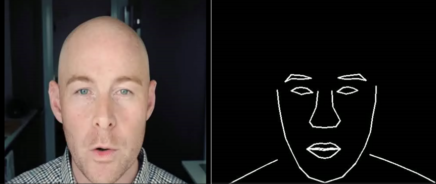

论文复现-LiveSpeechPortraits

**详情请查看文档"语音识别-论文复现-LiveSpeechPortraits.docx"以及“演示视频.mkv”**

**详情请查看文档"语音识别-论文复现-LiveSpeechPortraits.docx"以及“演示视频.mkv”**

**详情请查看文档"语音识别-论文复现-LiveSpeechPortraits.docx"以及“演示视频.mkv”**

选取的论文：LiveSpeechPortraits

实现的功能：输入指定音频（这里音频路径在/properties/model/live_speech_portraits.yaml中指定），根据预训练的模型（每个模型都是因人而定的）生成视频，视频内容为对应人物说话，且口型与音频一致。

训练：无，因为论文作者并没有提供训练代码和对应的数据集，据作者所言此论文为他在实习期间完成，其训练代码及其相关内容的版权均属于其公司，不能对外分享，但是提供了生成的模型以及部分代码以供验证。

下面两张图为缺失训练的原因：

运行：

在命令行中输入如下命令，即可运行。

python run_talkingface.py --model=live_speech_portraits --dataset=live_speech_portraits --evaluate_model_file=notNone

命令行截图如下所示，其他截图请查看**文档"语音识别-论文复现-LiveSpeechPortraits.docx"以及“演示视频.mkv”**：

下图为验证的截图，详情查看**文档"语音识别-论文复现-LiveSpeechPortraits.docx"以及“演示视频.mkv”**

验证截图：

验证说明：如果需要验证其他音频或其他说话人，请修改talkingface/properties/model处的live_speech_portraits.yaml，除model_params处的APC的ckp_path无需修改外，其他路径请都修改为你所需要指定的音频和说话人。

注意：验证所需的模型和数据请从此处[data - Google 云端硬盘](https://drive.google.com/drive/folders/1sHc2xEEGwnb0h2rkUhG9sPmOxvRvPVpJ)下载，并且放在checkpoints/live_speech_portraits目录下。

所使用的依赖：

absl-py==2.1.0
aiosignal==1.3.1
albumentations==0.5.2
anyio==4.2.0
attrs==23.2.0
cachetools==5.3.2
click==8.1.7
cog==0.9.4
colorlog==6.7.0
dominate==2.9.1
exceptiongroup==1.2.0
fastapi==0.98.0
filelock==3.13.1
fonttools==4.25.0
frozenlist==1.4.1
google-auth==2.26.2
google-auth-oauthlib==0.4.6
grpcio==1.60.0
h11==0.14.0
h5py==3.10.0
httptools==0.6.1
imageio==2.33.1
imgaug==0.4.0
Jinja2==3.1.3
jsonschema==4.21.0
jsonschema-specifications==2023.12.1
librosa==0.7.0
llvmlite==0.31.0
Markdown==3.5.2
MarkupSafe==2.1.4
mkl-service==2.4.0
mpmath==1.3.0
munkres==1.1.4
networkx==3.1
numba==0.48.0
numpy==1.20.3
oauthlib==3.2.2
opencv-python==3.4.9.33
opencv-python-headless==4.9.0.80
pandas==1.3.4
pkgutil_resolve_name==1.3.10
protobuf==3.19.0
pyasn1==0.5.1
pyasn1-modules==0.3.0
pydantic==1.10.14
python-dotenv==1.0.1
python-speech-features==0.6
pytz==2023.3.post1
PyWavelets==1.4.1
PyYAML==6.0.1
ray==2.6.3
referencing==0.32.1
requests-oauthlib==1.3.1
resampy==0.3.1
rpds-py==0.17.1
rsa==4.9
scikit-image==0.16.2
scipy==1.10.1
shapely==2.0.2
sniffio==1.3.0
starlette==0.27.0
structlog==24.1.0
sympy==1.12
tensorboard==2.7.0
tensorboard-data-server==0.6.1
tensorboard-plugin-wit==1.8.1
texttable==1.7.0
torch==1.13.1
torchaudio==0.13.1
torchvision==0.14.1
tqdm==4.66.1
tzdata==2023.4
uvicorn==0.27.0.post1
watchfiles==0.21.0
websockets==12.0
Werkzeug==3.0.1

成员分工：晏永磊完成了所有工作，因为这个组只有他一人。

