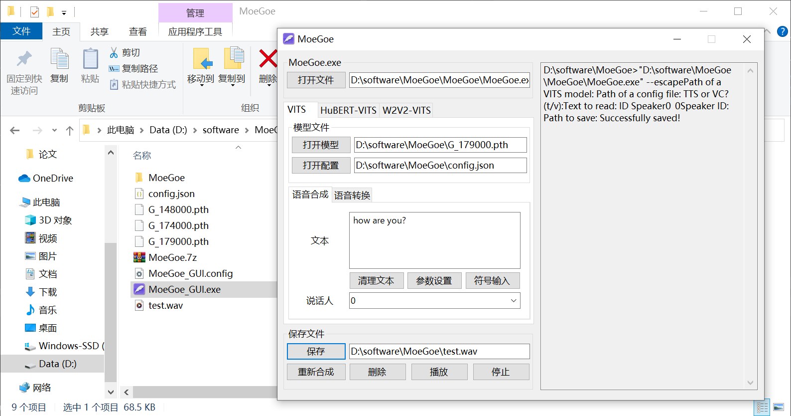

# Variational Inference with adversarial learning for end-to-end Text-to-Speech (VITS)

原论文链接：https://arxiv.org/abs/2106.06103

原仓库链接：https://github.com/jaywalnut310/vits

## 完成的功能

1. 对VITS的训练整合到talkingface的框架中

2. 实现训练功能

3. 推理部分通过使用MoeGoe实现


## 最终实现的训练

目前实现的是单人说话，使用的是LJSpeech英文演讲数据集，因为训练需要的时间过久，而且将代码放到talkingface，缩减了一些训练加速相关的代码，移除了部分多gpu分布式训练相关代码，因而训练速度极慢……

使用当前的代码，在windows笔记本上运行了半个小时1个epoch都没有结束……

另外，本代码已经经过linux运行验证，并不会出现移植后训练代码错误的情况，部署具有可靠性。


### 如何在这里进行训练：

#### 1. 创建虚拟环境

首先创建虚拟环境：

```bash
conda create -n vits_linux python=3.7 -y
conda activate vits_linux

# PyTorch 1.13.1
# CUDA 11.6
pip install torch==1.13.1+cu116 torchvision==0.14.1+cu116 torchaudio==0.13.1 --extra-index-url https://download.pytorch.org/whl/cu116

pip install librosa==0.8.0

pip install cython

pip install pyyaml
pip install colorlog
pip install pandas
pip install tensorboard
pip install texttable
pip install colorama
pip install tqdm
pip install opencv-python
pip install jamo
pip install ko_pron
pip install pypinyin
pip install jieba
pip install cn2an
pip install indic_transliteration
pip install num_thai
pip install opencc
pip install python_speech_features
pip install scikit-image
```

上面的流程在linux下成功运行，遵守上面的安装步骤应该可以成功运行本代码。

如果没有成功运行本代码，大部分的错误应当是缺少某些库，可以直接使用pip install进行下载安装。

除了上面的安装环境方式，还可以使用下面的命令直接安装：

* 假如是linux：

  ```bash
  conda create -n vits_linux python=3.7 -y
  conda activate vits_linux
  pip install -r requirements_vits_linux.txt
  ```

* 假如是windows：

  ```bash
  conda env create -f environment_vits_windows.yml
  ```


#### 2. 下载并解压数据集

在最终训练之前，需要先初始化环境下载LJSpeech数据集，既可以从[官网下载](https://keithito.com/LJ-Speech-Dataset/)，也可以从[百度网盘下载](https://pan.baidu.com/s/1oTBcZawH7YpysQeYk8-5fw?pwd=706s)。

百度网盘中有两个版本，`LJSpeech-1.1.zip`是没有处理过的，`LJSpeech_processed.zip`是处理过可以直接用的。

假设下载的是处理过可以直接用的，**将压缩包放到文件夹`dataset`下面**，将压缩包中的内容解压到当前文件夹即可：

```bash
cd ./dataset
unzip LJSpeech_processed.zip
cd ..
```


#### 3. Build monotonic alignment search

下载好数据集后，还有一步很重要的操作：Build monotonic alignment search。

首先开启当前虚拟环境，运行如下代码：

```bash
# 需要先到talkingface/utils/vits_utils/monotonic_align/文件夹下
cd ./talkingface/utils/vits_utils/monotonic_align/

# 然后build
python setup.py build_ext --inplace
```

linux会直接成功，windows一般会报错。

如果出现“可能丢失数据”字样，并且该文件夹没有再嵌套一个monotonic_align文件夹，但是多出来了build文件夹，将build文件夹中的lib开头的文件夹中的monotonic_align文件夹移动到最外层的monotonic_align文件夹即可。

**注意：Windows下build后的core不与Linux通用，如果更换平台需要重新build。**


#### 4. 调整训练参数

在文件夹`talkingface/properties/`下是模型的参数设置，比较重要的设置有两个：

1. `overall.yaml`中的第一个`gpu_id`设置，设置其在哪个gpu上训练，训练前请不要忘记选择正确的gpu进行训练
2. `model/VITS.yaml`中存储的是有关模型训练时的设置，其中的`batch_size`参数和gpu内存占用高度相关，请调整其到合适的大小


#### 5. 运行训练代码

之后在仓库的根路径下打开终端，复制下面的指令即可进行训练。如果想要测试，可以将模型放入[MoeGoe](https://github.com/CjangCjengh/MoeGoe)中进行语音的生成

```bash
python run_talkingface.py --model=VITS --dataset=LJSpeech
```

* windows上的训练（因为太慢了所以就截了一个训练开始的图）：
  

* linux上的训练：
  


## 验证截图

通过原来的代码仓库给出的一个软件（MoeGoe）可以进行推理，生成语音：




## 所使用的依赖

因为VITS用的是python3.7，所以就也用了同样的版本，别的依赖和原仓库略有不同，具体可以看[environment_vits_windows.yml](./environment_vits_windows.yml)或是[requirements_vits_linux.txt](./requirements_vits_linux.txt)

- `python=3.7`
- `torch==1.13.1+cu117`
- `librosa==0.8.0`

环境的安装方法已经在上面有过介绍了，如果需要的话可以看[创建虚拟环境](#1. 创建虚拟环境)那一节

## 成员分工

- 柳绍祯：阅读vits源码，对代码重构做出理解，让最终的代码成功运行
- 尹祯：整合数据集、参数配置、模型方面的代码
- 白宇：整合训练和测试过程相关代码