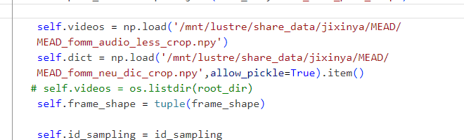

# EAMM

[Source](https://github.com/jixinya/EAMM)

## 分工

高鹏 1120210558：个人完成。

## 准备工作

下载模型权重 [google-drive](https://drive.google.com/file/d/1IL9LjH3JegyMqJABqMxrX3StAq_v8Gtp/view?usp=sharing)，

将里面的三个 `.pth.tar` 文件放到 `checkpoints/EAMM/` 路径下。

该路径下应该包括以下8个文件：`1-6000.pth.tar`, `5-3000.pth.tar`, `124_52000.pth.tar`, `M003_template.npy`, `shape_predictor_68_face_landmarks.dat`, `mb1_120x120.pth`, `bfm_noneck_v3.pkl`, `param_mean_std_62d_120x120.pkl` 。

然后进入 `talkingface\utils\pose_3ddfa\FaceBoxes\utils` 目录，运行以下命令（需要安装 Cython 库）：

```bash
python3 build.py build_ext --inplace
```


## 使用方法

**预处理**

预处理在框架中自动完成，包括三个部分：

- 将视频按帧导出为图片序列，大小为 (256,256,3)
- 提取音频的mfcc特征导出为 `.npy` 文件
- 提取人脸的姿态数据导出为 `.npy` 文件

处理好的文件分别位于数据集中 `preprocessed_data` 目录下的 `crop`, `MEAD_MFCC` 和 `pose`。


**训练**

在作者开源的代码中，训练所需的数据集和模型部分，存在一些错误，包括：

- 数据集构建的代码中包括作者本机的文件地址，文档或注释中也并未说明这些文件是怎么来的，需要哪些处理，自己尝试复现可能需要花费大量时间和算力，故而放弃

- 训练所需的模型代码中存在大量变量未定义的报错，应该是没有将完整的代码传上去

综上所述，最后未能复现训练部分。但是，训练相关的代码均已补充完整，后面可以在此基础上尝试填补上述缺漏。

**推理**

```bash
python .\run_talkingface.py -m EAMM -d mead --config_files '.\talkingface\properties\overall.yaml .\talkingface\properties\model\EAMM.yaml .\talkingface\properties\model\EAMM\evaluate.yaml' --evaluate_model_file .\talkingface\properties\model\EAMM\evaluate.yaml
```

推理过程的配置主要在 `evaluate.yaml` 中，主要的配置包括：

- **source_image**：生成结果所使用的人脸图片
- **driving_video**：生成结果所使用的表情视频
- **in_file**：生成结果所使用的驱动语音
- **pose_file**：生成结果所使用的人脸的姿态数据
- **emotion**：生成的表情，包括 'angry', 'contempt','disgusted','fear','happy','neutral','sad','surprised'

据论文所述，上述文件均不必来自同一源视频。

生成的结果位于 `saved\eamm\output\` 下，`mp4` 是不带声音的，`mov` 是带声音的，`emotion.mov` 是生成结果，`all.mov` 是和驱动视频的效果对比。

