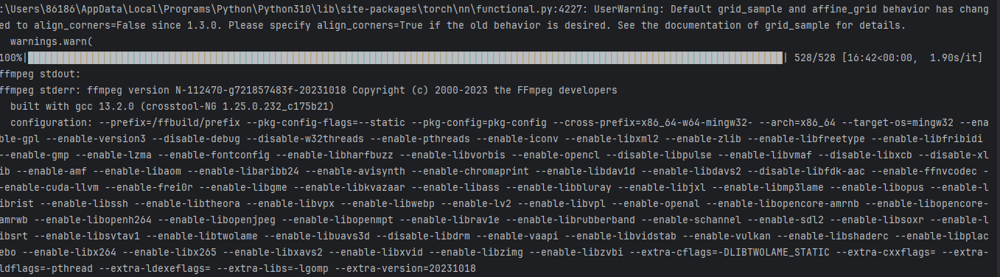
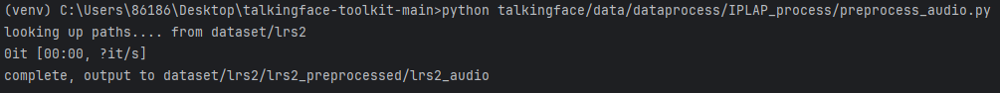

# talkingface-toolkit-IPLAP

> **陶雪松     1120210485**


原论文链接：[[Paper]](https://arxiv.org/abs/2305.08293) 

源代码链接：[[Code]](https://github.com/Weizhi-Zhong/IP_LAP) 

## 环境配置
- Python 3.10
- torch 1.13.0+cu117（本地复现使用，采用框架所给版本也可以正常运行）
- torchvision 0.14.0+cu117（本地复现使用，采用框架所给版本也可以正常运行）
- ffmpeg

在框架相关环境`requirements.txt`配置结束后，请运行以下命令配置运行本模型所需的额外依赖：
```
pip install -r requirements_IPLAP.txt
```
**冲突说明**：librosa由于在0.10.1版本进行了方法的更新有些方法的参数被取消了，使用框架中的版本会在运行时发生错误，需保留0.9.2版本才能正常运行。

```python
librosa==0.9.2
```

## 模型简介


IPLAP实现了一个包含音频到特征点生成和特征点到视频渲染的两阶段框架。首先，模型利用一个基于Transformer的特征点生成器，从音频中推断出嘴唇和下颌的特征点。在这一过程中，模型使用发言者面部的姿态先验特征，使生成的特征点与发言者的面部轮廓一致。之后，模型通过视频渲染器，将生成的特征点转换为面部图像。在这个阶段，模型将从下半部分被遮挡的目标面部和静态参考图像中提取先验外观信息，这有助于生成逼真且保留身份信息的视觉内容。为了有效探索静态参考图像的先验信息，视频渲染器根据运动场将静态参考图像与目标面部的姿态和表情对齐，并且再次使用音频中提取到的听觉特征以确保生成的面部图像与音频保持同步。经过复现与测试，相较于其他传统方法，该模型的确能够产生更为逼真、嘴唇同步且保留身份信息的视频。

## 快速启动

### 快速启动说明

原作者使用了4个24G RTX3090在CUDA 11.1环境下进行了训练，我复现代码时将相关的多GPU训练修改为单卡训练，但由于本人轻薄本的显卡仅有2G显存，性能实在有限，进行训练的时间过长，反馈很慢。故快速启动仅展示了模型的评估过程。模型中特征生成器和视频渲染器两个网络的训练过程将在后续的分步操作中给出。

### 运行快速启动

首先，从[jianguoyun](https://www.jianguoyun.com/p/DeXpK34QgZ-EChjI9YcFIAA)中下载好预训练参数, 并将它们放置到 `talkingface/model/audio_driven_talkingface/IPLAP/test/checkpoints`中 。

在终端输入以下命令，模型将进行Talking face视频生成并输出评估结果，模型保存在项目根目录下的`test_result`文件夹中，生成模型过程中产生的中间文件（调整帧率后的输入视频、与音频合成前的带有人脸草图的生成视频）保存在项目根目录下的`tempfile_of_test_result`文件夹中。

```
python run_talkingface.py --model=IPLAP –dataset=lrs2
```

运行程序后，输出信息如下所示：


等待评估结束后（预留的测试视频一般需要处理15-20分钟左右），程序输出信息与评估结果如下：




最终可以在`tempfile_of_test_result`文件夹中查看中间文件，在`test_result`文件夹中查看生成结果。


最终生成Talking Face视频的效果展示如下（均保留了人脸草图）：

这是LRS2数据集中的第129个视频中处理得到的人脸图像基于我所截取的一段外国新闻语音生成的视频。


https://github.com/Tao-xuesong/talkingface-toolkit/assets/104686841/5093e1de-f58d-4ce4-ac77-d4b11926a6e0


以下视频的人像来自于我所截取的中国新闻联播的视频片段，视频的语音使用了和上一个视频相同的外国新闻语音。


https://github.com/Tao-xuesong/talkingface-toolkit/assets/104686841/cf68236e-9d5a-4116-ad58-2ca5fe49878d


以下视频的人像来自于我所截取的外国新闻节目的视频片段，视频的语音使用了截取自另一段访谈节目的男性语音。


https://github.com/Tao-xuesong/talkingface-toolkit/assets/104686841/491df4d5-76c2-452e-8494-02dbf1d52e52


## 分步操作

这一部分给出了运行模型的分步操作，以便能在性能足够的环境中运行数据集的预处理以及两个网络的训练程序。

## 预处理与训练

### 下载 LRS2 数据集
模型在LRS2上训练. 请前往[LRS2](https://www.robots.ox.ac.uk/~vgg/data/lip_reading/lrs2.html)网站下载数据集。LRS2 数据集文件夹结构如下：
```
data_root (mvlrs_v1)
├── main, pretrain (I use only main folder in this work)
|	├── list of folders
|	│   ├── five-digit numbered video IDs ending with (.mp4)
```
main 文件夹是下面提到的 lrs2。

### 预处理音频
通过运行以下命令从视频文件中提取原始音频和 Mel 频谱特征：
```
# 确保当前项目根目录（talkingface-toolkit-main）已经添加到了 PYTHONPATH 环境变量中，防止后续软件包无法正确导入（路径设置为根目录所在路径）

set PYTHONPATH=\your\path\to\talkingface-toolkit-main;%PYTHONPATH%

# 运行以下程序预处理音频，预处理后的音频保存在dataset/lrs2/lrs2_preprocessed/lrs2_audio中

python talkingface/data/dataprocess/IPLAP_process/preprocess_audio.py

# 如果想要修改原始视频数据位置或更改预处理后音频的保存位置可以传入“--data_root”和“--out_root”参数

python preprocess_audio.py --data_root ....../lrs2/ --out_root ..../lrs2_audio

```
处理完成后的效果(带有数据集时预处理较慢，此截图为处理空数据集结果)




### 预处理视频的面部

通过运行以下命令从视频文件中提取裁剪的面部、特征点和草图

```
# 运行以下程序预处理视频面部，预处理后的裁剪面部、特征点和草图文件分别保存在dataset/lrs2/lrs2_preprocessed下的三个文件夹中

python talkingface/data/dataprocess/IPLAP_process/preprocess_video.py

# 如果想要修改原始视频数据位置或更改预处理后的裁剪面部、特征点和草图文件的保存位置可以传入“--dataset_video_root”、“--output_sketch_root”、“--output_face_root”和“--output_landmark_root”参数

python preprocess_video.py --dataset_video_root ....../lrs2/ --output_sketch_root ..../lrs2_sketch --output_face_root ..../lrs2_face --output_landmark_root ..../lrs2_landmarks
```

处理完成后的效果(带有数据集时预处理较慢，此截图为处理空数据集结果)


### 训练特征点生成器

通过运行以下命令训练特征点生成器网络

```
# 预处理的文件保存在默认位置直接运行即可
python talkingface/model/audio_driven_talkingface/IPLAP/train_landmarks_generator.py

# 如果之前修改了原始数据位置请传入相应参数
python talkingface/model/audio_driven_talkingface/IPLAP/train_landmarks_generator.py --pre_audio_root ..../lrs2_audio --landmarks_root ..../lrs2_landmarks
```

读取train.txt文件，开始训练时输出如下：


### 训练视频渲染器

通过运行以下命令训练视频渲染器网络：
```
# 预处理的文件保存在默认位置直接运行即可
python talkingface/model/audio_driven_talkingface/IPLAP/train_video_renderer.py

# 如果之前修改了原始数据位置请传入相应参数
python talkingface/model/audio_driven_talkingface/IPLAP/train_video_renderer.py --sketch_root ..../lrs2_sketch --face_img_root ..../lrs2_face  --audio_root ..../lrs2_audio
```
请注意，翻译模块只会在 25 个 epoch 后开始训练，因此 fid 和 running_gen_loss 只会在第 25 个 epoch 后开始下降。

视频渲染器开始训练后输出如下：

**注意：**开始训练后，一些相关网络权重将自动从GitHub上在线下载，请确保网络能够连接上GitHub！


训练相关信息保留在`tensorboard_runs`文件夹中。

## 评估

从[jianguoyun](https://www.jianguoyun.com/p/DeXpK34QgZ-EChjI9YcFIAA)下载预训练参数, 并将它们放置到 `talkingface/model/audio_driven_talkingface/IPLAP/test/checkpoints`中（两个模型的预训练模型均不大，已提前放置好并成功上传GitHub） 。然后运行以下命令：

```
python talkingface/model/audio_driven_talkingface/IPLAP/inference_single.py
```

本次复现我一共提供了三个不同的测试视频和四个不同的测试音频，要在其他视频上（非默认测试视频上）运行，请指定 --input 和 --audio 参数来传入视频和音频所在地址。

## 人员分工

本小组为单人小组，由陶雪松独立完成了论文的阅读，数据集的处理，用于测试的视频文件、音频文件的制作与处理，代码的调试、修改和与所给框架的适配，以及最终的配置文件和README文件的编写。
