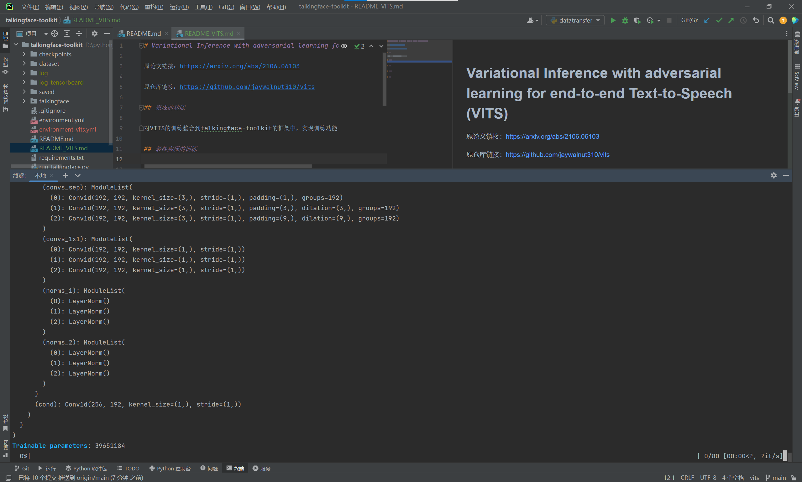
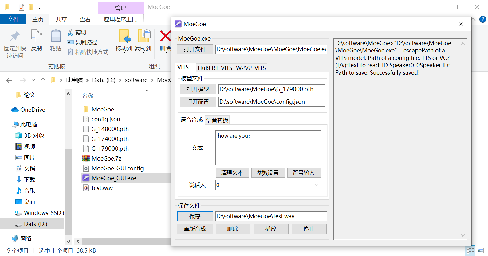

# Variational Inference with adversarial learning for end-to-end Text-to-Speech (VITS)

原论文链接：https://arxiv.org/abs/2106.06103

原仓库链接：https://github.com/jaywalnut310/vits

## 完成的功能

对VITS的训练整合到talkingface的框架中，实现训练功能。

## 最终实现的训练

目前实现的是单人说话，使用的是LJSpeech英文演讲数据集，因为训练需要的时间过久，而且将代码放到talkingface，缩减了一些训练加速相关的代码，移除了部分多gpu分布式训练相关代码，因而训练速度极慢……

使用当前的代码，在我的电脑上运行了半个小时1个epoch都没有结束……

### 如何在这里进行训练：

在最终训练之前，需要先初始化环境下载LJSpeech数据集，可以从[百度网盘下载](https://pan.baidu.com/s/1oTBcZawH7YpysQeYk8-5fw?pwd=706s)，里面有两个版本，`LJSpeech-1.1.zip`是没有处理过的，`LJSpeech_processed.zip`是处理过可以直接用的。

假设下载的是处理过可以直接用的，将压缩包放到文件夹`dataset`下面，将压缩包中的内容解压到当前文件夹即可。

下载好数据集后，还有一步很重要的操作：Build monotonic alignment search。

首先开启当前虚拟环境，在`talkingface/utils/vits_utils/monotonic_align`目录下的终端中运行如下代码：

```bash
python setup.py build_ext --inplace
```

linux会直接成功，windows一般会报错。

如果出现“可能丢失数据”字样，并且该文件夹没有再嵌套一个monotonic_align文件夹，但是多出来了build文件夹，将build文件夹中的lib开头的文件夹中的monotonic_align文件夹移动到最外层的monotonic_align文件夹即可。

注意：Windows下build后的core不与Linux通用，如果更换平台需要重新build。

之后在仓库的根路径下打开终端，复制下面的指令即可进行训练。如果想要测试，可以将模型放入[MoeGoe](https://github.com/CjangCjengh/MoeGoe)中进行语音的生成

```bash
python run_talkingface.py --model=VITS --dataset=LJSpeech
```



## 验证截图

通过原来的代码仓库给出的一个软件可以进行验证生成语音：



## 所使用的依赖

因为VITS用的是python3.7，所以就也用了同样的版本，别的依赖和原仓库略有不同，具体可以看[environment_vits.yml](environment_vits.yml)

- `python=3.8`
- `torch==1.13.1+cu117`
- `librosa==0.8.0`

通过下面的方式安装环境（这个environment_vits.yml是windows环境下导出的，linux可能用不了，不过可以参考vits源码中的requirements.txt下载）：

```bash
conda env create -f environment_vits.yml
```

## 成员分工

- 柳绍祯：阅读vits源码，对代码重构做出理解，让最终的代码成功运行
- 尹祯：整合数据集、参数配置、模型方面的代码
- 白宇：整合训练和测试过程相关代码