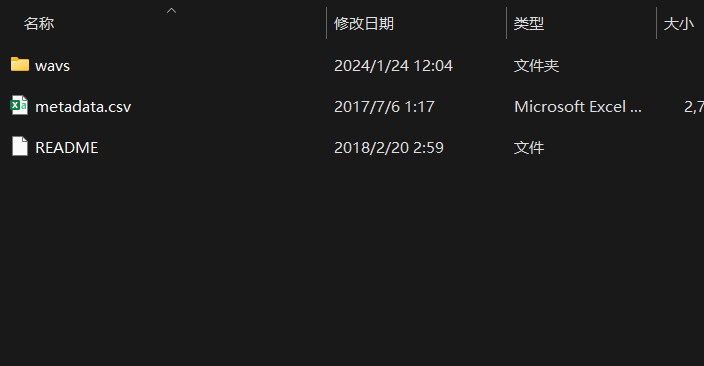
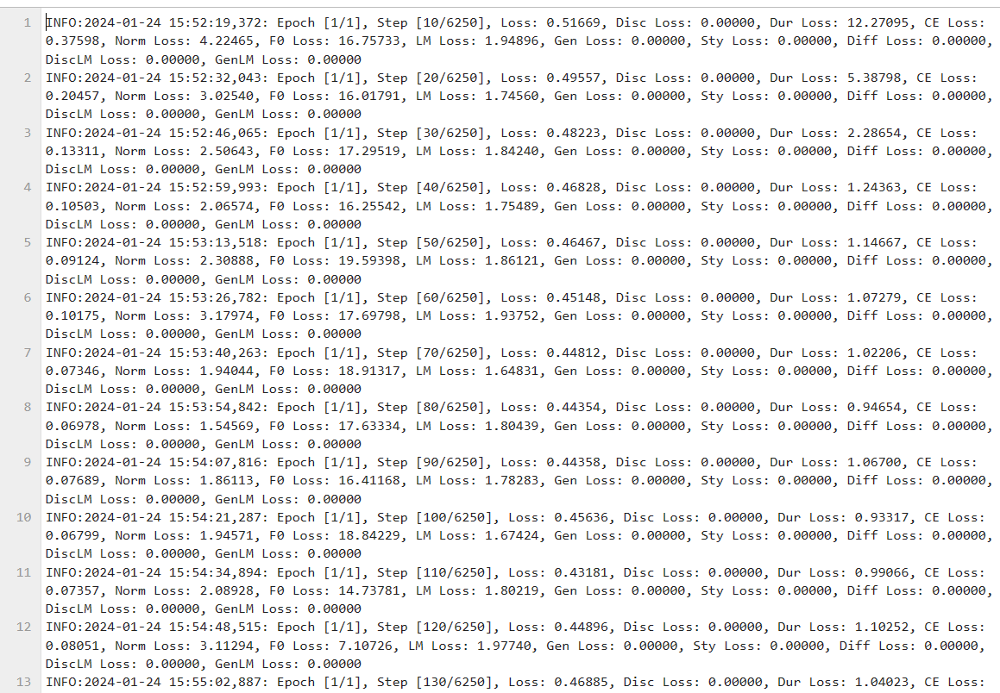

# talkingface-toolkit小组作业
小组成员名单：
申铄  金奕舟  王之禾  陈锦超  胡雨轩  

<!-- TOC -->

- [talkingface-toolkit小组作业](#talkingface-toolkit小组作业)
  - [模型选择](#模型选择)
  - [作业环境](#作业环境)
  - [数据集](#数据集)
  - [运行说明](#运行说明)
    - [运行准备](#运行准备)
    - [配置文件修改](#配置文件修改)
    - [运行指令](#运行指令)
  - [实现功能](#实现功能)
  - [操作过程与结果截图](#操作过程与结果截图)
    - [安装requirements环境](#安装requirements环境)
    - [配置文件确认](#配置文件确认)
    - [加上HF\_ENDPOINT=https://hf-mirror.com前缀后运行，进行训练](#加上hf_endpointhttpshf-mirrorcom前缀后运行进行训练)
    - [demo文件推理](#demo文件推理)
  - [所用依赖](#所用依赖)
  - [成员分工](#成员分工)
  - [华为云modelarts局限/花絮](#华为云modelarts局限花絮)
    - [上传大一点的文件需要OBS桶中转](#上传大一点的文件需要obs桶中转)
    - [Modelarts用户没有root权限](#modelarts用户没有root权限)
    - [batch\_size不调小的话...modelarts的GPU不够](#batch_size不调小的话modelarts的gpu不够)
    - [关于espeak和phonemizer的安装](#关于espeak和phonemizer的安装)
  - [后来的调整](#后来的调整)

<!-- /TOC -->

## 模型选择
我们选择复现的模型是[StyleTTS2](https://github.com/yl4579/StyleTTS2)模型，一种文本转语音模型，它利用风格扩散和对抗训练以及大型语音语言模型 （SLM） 来实现人类水平的 TTS 合成。


## 作业环境
实验使用华为云的modelarts控制台下的notebook进行。

推理部分由于华为云局限太多，考虑到推理部分的硬件资源不再是硬性要求，选择本机推理。

华为云modelarts配置采用pytorch1.8-cuda10.2-cudnn7-ubuntu18.04镜像和GPU: 1*T4(16GB)|CPU: 8核 32GB规格，20GB云硬盘。

配置截图如下：


使用华为云modelarts提供了硬件资源和一定的镜像资源，但事实上也有不太方便的地方，后面的实验过程中会提到。

所需库（这部分在所需依赖目录下也有）
可以使用两个空格加回车来实现换行显示，如下所示：

SoundFile  
torchaudio  
munch  
torch  
pydub  
pyyaml  
librosa  
nltk  
matplotlib  
accelerate  
transformers  
einops  
einops-exts  
tqdm  
typing  
typing-extensions  
git+https://github.com/resemble-ai/monotonic_align.git  
(推理demo需要额外安装phonemizer和espeak)


## 数据集
GitHub代码仓库中本身提供了三个txt文件，指定数据集是LJSPeech，我们使用官网下载的LJSPeech-1.1。模型自带的文本对齐器和音高提取器在 24 kHz 数据上进行了预训练，数据上采样至 24 kHz较为合适(可在配置文件中查看)。




## 运行说明
### 解压一个文件
请先把Utils/ASR/epoch_00080.zip解压到当前目录再继续，GitHub客户端似乎无法上传.pth文件，但这个是运行所需的，所以就打包了一下。

### 运行准备

从头开始进行train_first较为耗时，且容易出现nan问题和其他报错，我们复现train_second来进行更加稳定的训练

运行download.ipynb单元格内容，下载所需预训练模型到checkpoints作为first_stage产物，为稳定训练做准备。

另外这个模型太大了，700多MB的pth文件，真心不好上传到GitHub上，所以就跟数据集一样删掉了，按上面的download.ipynb所示，提供了预训练模型，如果不想再验证训练过程，也可以在下载好之后，直接用demo文件夹里面那个ipynb跑推理，但是需要将checkpoints中的预训练模型转移到Models/LJSpeech/中。（这个目录是训练时生成的，用于保存配置/日志/模型，推理demo默认使用这个目录中的配置和模型）

推理时Models/LJSpeech/目录下应该有配置文件和保存模型：


### 配置文件修改
在配置文件中修改可能需要调整的数据集路径和first_stage_path路径(first_stage_path默认在checkpoints中)

### 运行指令

因为该模型的指定使用LJSPeech，所以默认配置中的数据集就是LJSPeech路径，代码需要用到huggingface相关资源，考虑访问问题，需要使用镜像网站hf-mirror.com，可以使用以下代码来运行即可开始训练。训练代码中包括train和val。

```bash
HF_ENDPOINT=https://hf-mirror.com python run_talkingface.py --model=StyleTTS2 --

```

由于GitHub代码仓库本身并没有特别编写evaluate相关的代码，只有一个notebook的demo，也没有数据集，不方便重构，且所需下载文件在华为云上似乎无法下载，这部分用本机做的，在demo文件夹里面，结果存放在result_wav中。


## 实现功能
实现train和val数据集加载，model构建加载，trainer对train和val数据集的训练评估过程。训练日志保存在Models/LJSpeech/中。

数据集加载主要通过StyleTTS2_dataset.py实现，其中有StyleTTS2的数据集类和数据加载器构建方法。

model构建主要通过StyleTTS2.py和Utils中的ASR/JDC/PLBERT三个文件夹实现，其中包括了模型的构建。

trainer对数据集的训练评估过程主要通过trainer.py和StyleTTS2_train_second.py实现。trainer.fit方法中调用训练过程。

其他：losses.py和optimizers.py负责训练时的部分损失计算和优化。

Demo文件夹中有ipynb文件是推理demo，因为原版本身没有专门编写推理部分的.py文件，使用ipynb进行demo实验，测试结果成功生成一系列wav文件。


## 操作过程与结果截图

### 安装requirements环境


### 配置文件确认
原版的batch_size是16，不调整这部分的话，刚进入训练时，华为云的GPU会爆，容量不够，这边修改为2（因为主要复现traine_second，进行第二次训练，所以配置中的epochs_1st可以先不管)


### 加上HF_ENDPOINT=https://hf-mirror.com前缀后运行，进行训练
huggingface在国内貌似是连不上了，模型中有slm组件需要从huggingface里面下载，需要使用镜像网站才能运行。训练过程截图如下：


训练日志展示如下：


### demo文件推理
如运行准备中所说，可以跳过训练，用初次的预训练模型来进行推理，只需要把checkpoints中下载的模型转移到Models/LJSpeech/（这是训练过程的保存路径）中即可，也可以用训练完成保存的模型来推理。
推理结果展示：


## 所用依赖

SoundFile  
torchaudio  
munch  
torch  
pydub  
pyyaml  
librosa  
nltk  
matplotlib  
accelerate  
transformers  
einops  
einops-exts  
tqdm  
typing  
typing-extensions  
git+https://github.com/resemble-ai/monotonic_align.git  
(推理demo需要额外安装phonemizer和espeak)


## 成员分工
申铄：整体流程与规划解读，数据集类代码重构，模型代码重构，训练代码重构，推理文件重构，配置文件调整，测试代码与bug修复，撰写实验报告。

金奕舟：部分配置调整，数据集整理，参与讨论相关，部分撰写实验报告。

王之禾：部分数据集加载重构，参与讨论相关，撰写使用报告。  

陈锦超：部分loss计算，部分优化器相关，参与讨论相关，撰写使用报告。  

胡雨轩：部分模型方法重构，参与讨论相关，撰写实验报告。  


## 华为云modelarts局限/花絮

### 上传大一点的文件需要OBS桶中转
一般模型可能没什么不方便的，但是这个StyleTTS2从代码仓库下下来就是100MB以上。

### Modelarts用户没有root权限
直接使用华为云无法完成全部，没有root权限，无法进行sudo apt来安装一些必要组件（如espeak）等。
Python版本也是3.7的，没有root权限执行不了安装操作，装不了3.8，运行quick_start时有报错，最后把quick_start的自动寻找类改为手动配置各个类来运行。

### batch_size不调小的话...modelarts的GPU不够
这个模型训练起来对硬件的要求比较高，batch_size使用默认的16，华为云的GPU也会爆

最后就调整为2了。

### 关于espeak和phonemizer的安装
这是推理部分的事了，装完espeak配置好环境变量，但是phonemizer还是一直有未安装espeak报错。

最后在GitHub评论区找到了解决方法，光自己调谁能想到要这么来修复QAQ：


## 后来的调整
后来把losses和optimizers转移到talkingface.utils中了，如果有遇到这两个引用失败可以看看是不是import那里忘改了。（应该都改了）