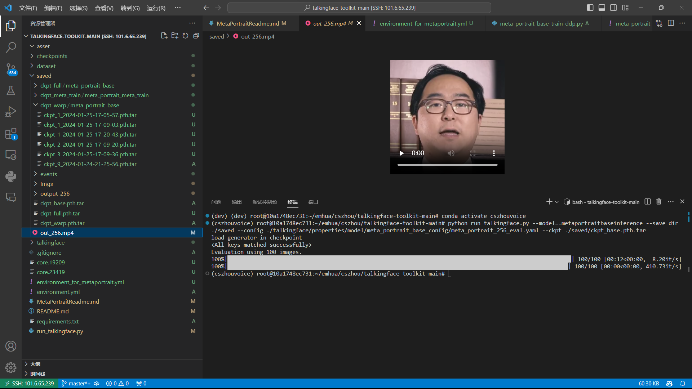
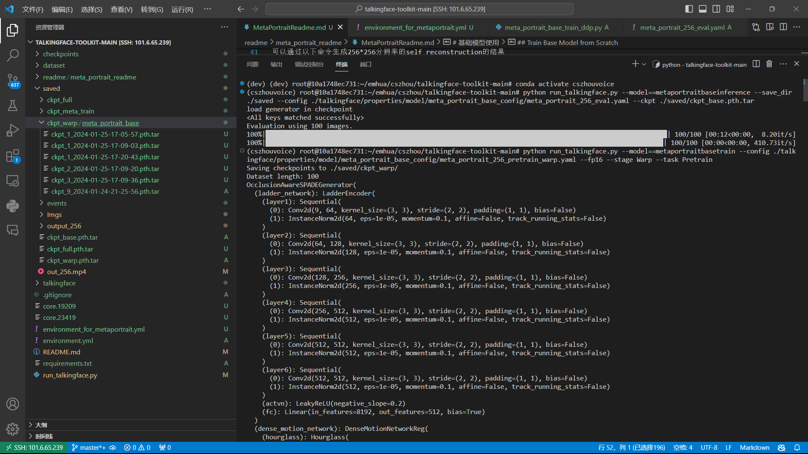
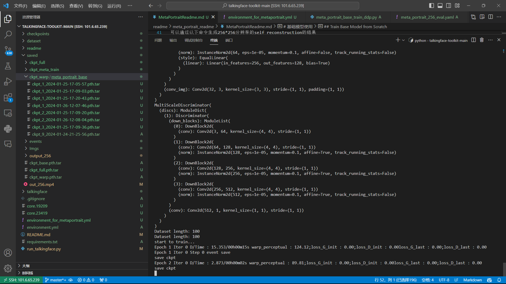
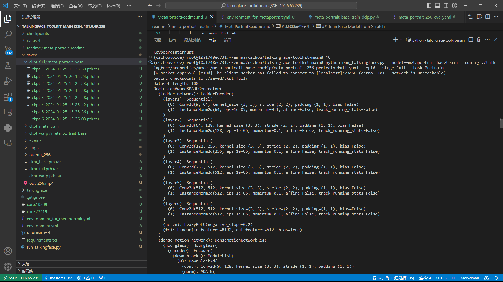
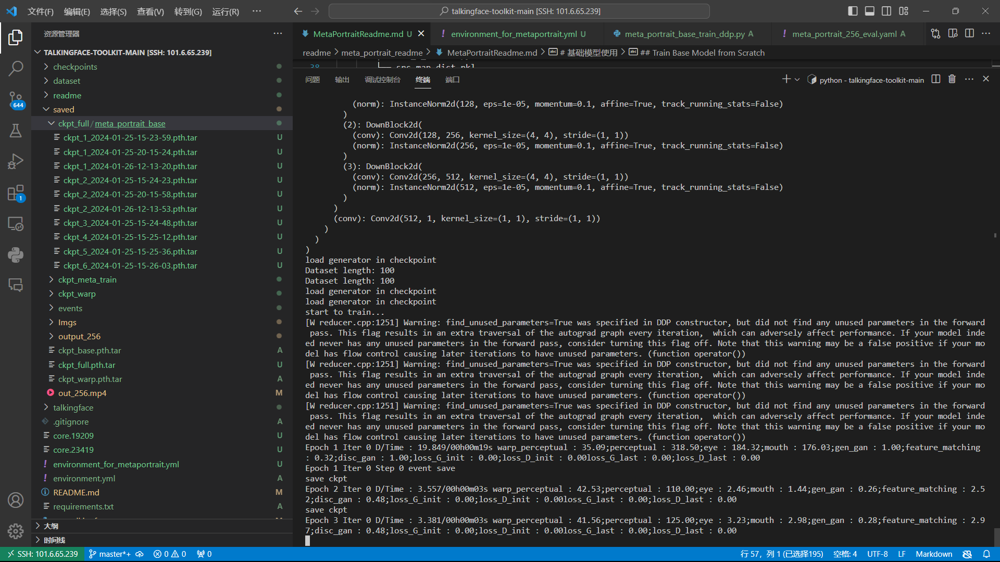
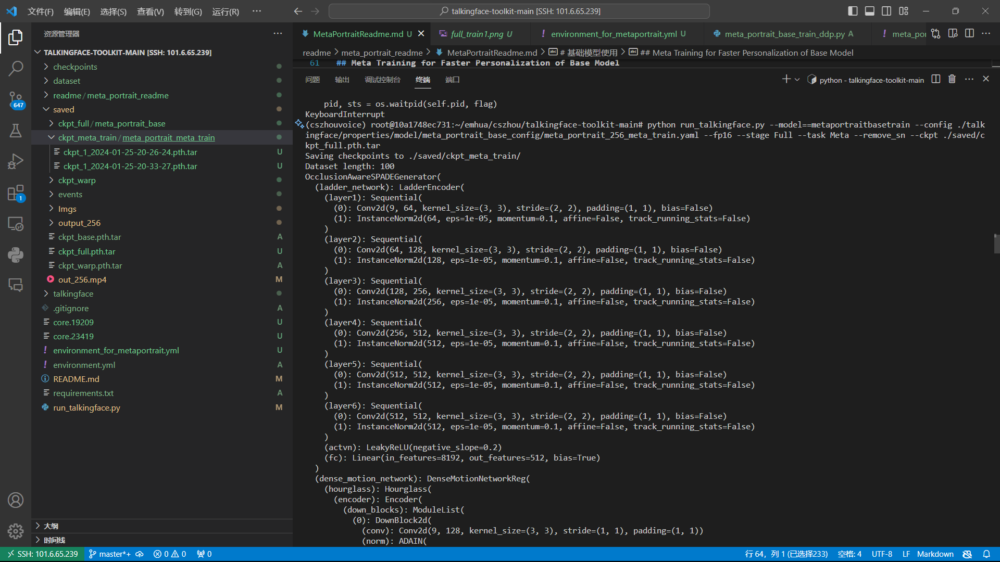
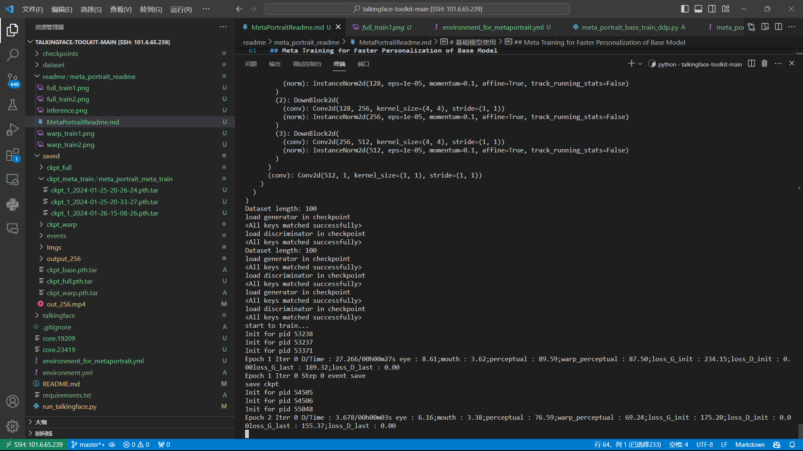

# 基本介绍
本模型整合模型的是"MetaPortrait: Identity-Preserving Talking Head Generation with Fast Personalized Adaptation(CVPR 2023)"论文提出的MetaPortrait模型，主要代码整合自[该仓库](https://github.com/Meta-Portrait/MetaPortrait#temporal-super-resolution-model)。本模型使用VoxCeleb2数据集，但原仓库代码未提供数据处理代码，完整数据处理需要借助其他模型提供的数据处理代码对数据集进行处理。在`dataset`文件夹下提供了少量处理好的数据用作演示。使用本模型能够生成256*256分辨率的talkingface。

# 环境设置及依赖
具体环境配置见`environment_for_metaportrait.yml`文件
```bash
cd talkingface
conda env create -f environment_for_metaportrait.yml
conda activate cszhouvoice
```

# 基础模型功能及使用

本模型主要配置文件位于`talkingface\properties\model\meta_portrait_base_config`目录下

## Inference Base Model
在运行推理代码之前需要首先下载[模型checkpoint](https://drive.google.com/file/d/1Kmdv3w6N_we7W7lIt6LBzqRHwwy1dBxD/view?usp=share_link)并将其放在`saved`文件夹下，下载[示例数据](https://drive.google.com/file/d/166eNbabM6TeJVy7hxol2gL1kUGKHi3Do/view?usp=share_link)解压放在`dataset/meta_portrait_base_data`下。

处理好后文件结构如下：
```
talkingface
├───saved
│   └───ckpt_base.pth.tar
└───dataset
    └───meta_portrait_base_data
        ├── 0
        │   ├── imgs
        │   │   ├── 00000000.png
        │   │   ├── ...
        │   ├── ldmks
        │   │   ├── 00000000_ldmk.npy
        │   │   ├── ...
        │   └── thetas
        │       ├── 00000000_theta.npy
        │       ├── ...
        ├── src_0_id.npy
        ├── src_0_ldmk.npy
        ├── src_0.png
        ├── src_0_theta.npy
        └── src_map_dict.pkl
```

可以通过以下命令生成256*256分辨率的self reconstruction的结果
```bash
python run_talkingface.py --model==metaportraitbaseinference --save_dir ./saved --config ./talkingface/properties/model/meta_portrait_base_config/meta_portrait_256_eval.yaml --ckpt ./saved/ckpt_base.pth.tar
```
推理成功后结果将保存在saved文件夹下，将生成output文件，推理成功截图见`readme/meta_portrait_readme/inference.png`


## Train Base Model from Scratch

### 训练warping网络
首先需要使用以下命令训练warping网络
```bash
python run_talkingface.py --model==metaportraitbasetrain --config ./talkingface/properties/model/meta_portrait_base_config/meta_portrait_256_pretrain_warp.yaml --fp16 --stage Warp --task Pretrain
```
训练成功后将生成.pth.tar的checkpoint，其结果保存在`saved/ckpt_warp/meta_portrait_base`下，训练成果截图见`readme/meta_portrait_readme/warp_train1.png`和`readme/meta_portrait_readme/warp_train2.png`



### 训练整个网络
在继续训练前需要从上一步训练结果`saved/ckpt_warp/meta_portrait_base`选择合适的checkpoint，将其重命名为`ckpt_warp.pth.tar`并将该文件移动到`saved`文件夹下（或者也可以直接修改config文件下的路径参数）。然后运行以下命令对整个网络进行训练。
```bash
python run_talkingface.py --model==metaportraitbasetrain --config ./talkingface/properties/model/meta_portrait_base_config/meta_portrait_256_pretrain_full.yaml --fp16 --stage Full --task Pretrain
```
训练成功后将生成.pth.tar的checkpoint，其结果保存在`saved/ckpt_full/meta_portrait_base`下，训练成果截图见`readme/meta_portrait_readme/full_train1.png`和`readme/meta_portrait_readme/full_train2.png`



## Meta Training for Faster Personalization of Base Model
在继续训练前需要从上一步训练结果`saved/ckpt_full/meta_portrait_base`选择合适的checkpoint，将其重命名为`ckpt_full.pth.tar`并将该文件移动到`saved`文件夹下（或者也可以直接修改config文件下的路径参数）。然后运行以下命令对整个网络进行元训练进而对网络进行个性化调优。
```bash
python run_talkingface.py --model==metaportraitbasetrain --config ./talkingface/properties/model/meta_portrait_base_config/meta_portrait_256_meta_train.yaml --fp16 --stage Full --task Meta --remove_sn --ckpt ./saved/ckpt_full.pth.tar
```
训练成功后将生成.pth.tar的checkpoint，其结果保存在`saved/ckpt_meta_train/meta_portrait_meta_train`下，训练成果截图见`readme/meta_portrait_readme/meta_train1.png`和`readme/meta_portrait_readme/meta_train2.png`



# 小组分工
本小组完成了metaportrait和styleheat模型修改工作，具体分工如下：
周楚舒：统筹分工与时间安排，阅读metaportrait论文，配置实验环境，参与小组讨论，跑通了metaportrait代码，并将metaportrait代码的base模块接入toolkit，编写metaportrait模型的说明文档
杨  梓：阅读metaportrait论文，配置实验环境，参与小组讨论，跑通了metaportrait源代码，完成数据集整理和重构，对temporal super-resolution model模块代码重构，部分接口撰写和调试
潘静雯：阅读metaportrait论文和源代码，配置实验环境，参加小组讨论和sr_model的调试工作，完成Temporal Super-resolution Model模型的数据集下载和预处理，撰写实验报告
王菁芃：阅读styleheat论文，配置实验环境，参与小组讨论，进行数据集下载和预处理，负责模型推理部分代码的调试与修改，编写styleheat模型说明文档
明  楷：阅读styleheat论文，配置实验环境，参与小组讨论，代码修改调试，撰写实验报告，进行loss计算