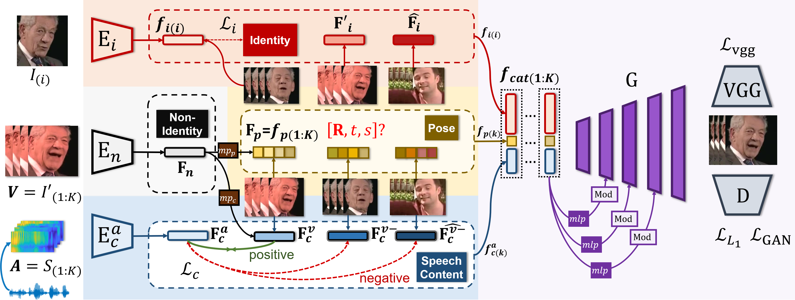

# talkingface-toolkit-PCAVS


原论文链接：https://arxiv.org/abs/2104.11116

源代码链接：https://github.com/Hangz-nju-cuhk/Talking-Face_PC-AVS


## 目录
  - [完成功能](#完成功能)
  - [验证截图](#验证截图)
  - [使用依赖](#使用依赖)
  - [成员分工](#成员分工)
  - [项目具体介绍](#项目具体介绍)
    - [快速生成演示结果](#快速生成演示结果)
    - [框架具体介绍](#框架具体介绍)
  

## 完成功能
该项目将 [PC-AVS(Pose-Controllable Talking Face Generation by
Implicitly Modularized Audio-Visual Representation)](https://github.com/Hangz-nju-cuhk/Talking-Face_PC-AVS) 的论文代码移植到 talkingface-toolkit 框架中，主要完成了以下工作：

1. 修改，调整了原论文中的 BaseDataset 与 VOXTestDataset 类，使其符合框架要求。
2. 理解并整理了原论文中有关推理的部分，将其整合进 talking-face 框架中，对模型进行评估(原论文代码不支持训练)
3. 增加 util 中部分工具函数，方便实现部分功能
4. 原论文代码采用封装 argparse 的方式，传递参数，为了符合整个框架，将参数传递方式修改为由 yaml 进行配置。


## 验证截图


这是使用原论文中的样例得到的推理结果。


推理过程截图


这是验证截图
## 使用依赖

主体与框架保持一致,部分依赖有变化

```text
librosa==0.9.1
lws==1.2.8
numpy==1.20.3
ffmpeg>=4.0.0
```

## 成员分工

| 成员 | 工作 |
| ----- | -----|
| 冯宇鹏 | 阅读论文，编写文档 README |
| 李奕霖 | 阅读论文，修改整理框架代码(eval 部分的代码)|
| 王宇璇 | 阅读论文，编写配置文件 yaml 文件等，编写文档 |
| 徐宇飞 | 阅读论文，修改整理框架代码(dataset 部分的代码)|
| 李嘉政 | 阅读论文，修改整理框架代码(util 部分的代码) |


## 项目具体介绍
PC-AVS(Pose-Controllable Talking Face Generation by
Implicitly Modularized Audio-Visual Representation) 是一种姿态可控的声像系统，该系统可以实现对任意面孔在说话同时实现对姿态的自由控制。不从音频中学习姿势动作，而是利用另一个姿势源视频来补偿头部动作。该系统的关键是设计一个隐式的低维姿势代码，它没有嘴型或身份信息。通过这种方式，视听表征被模块化为三个关键因素的空间:语音内容、头部姿势和身份信息。


原论文中项目演示截图与网络框架概述如图




### 快速生成演示结果

使用 `pip` 搭建环境
```
pip install -r requirements.txt
```

部分依赖有改动
```text
librosa==0.9.1
lws==1.2.8
numpy==1.20.3
ffmpeg>=4.0.0
```


相关依赖安装截图

在 [checkpoints](#checkpoints) 一节中下载相关的预训练模型

运行如下命令

```bash
python run_talkingface.py --model=PC_AVS --dataset=PC_AVSDataset --evaluate_model_file ./checkpoints/PC_AVS/simple_model.pth --config_files ./talkingface/properties/model/PC_AVS.yaml
```
即可看到验证结果


### 框架具体介绍


#### checkpoints

主要保存的是训练和评估模型所需要的额外的预训练模型，在对应文件夹的[README](https://github.com/Academic-Hammer/talkingface-toolkit/blob/main/checkpoints/README.md)有更详细的介绍

保存 PC-AVS 中使用到的五个预训练模型。

下载 [链接](https://drive.google.com/file/d/1Zehr3JLIpzdg2S5zZrhIbpYPKF-4gKU_/view?usp=sharing) 中的 zip 文件，解压缩到 `checkpoints/PC_AVS/demo` 文件夹下。


在 evaluate 过程中还会下载预训练模型保存在 checkpoints 中。


#### datset

存放数据集以及数据集预处理之后的数据，详细内容见dataset里的[README](https://github.com/Academic-Hammer/talkingface-toolkit/blob/main/dataset/README.md)


#### talkingface


##### config

将原论文代码中的 argparse 中 parser 对象中参数改为由 yaml 文件配置，部分参数如下：


##### data
`data` 文件夹结构如下：
```text
.
├── __init__.py
├── dataprocess
│   ├── __init__.py
│   ├── align_68.py
│   ├── prepare_testing_files.py
│   └── wav2lip_process.py
└── dataset
    ├── __init__.py
    ├── dataset.py
    ├── pc_avs_dataset.py
    └── wav2lip_dataset.py
```

我们支持自定义的数据集，使用方法如下：

模型只处理类似voxceleb2的裁剪数据，因此需要预处理自准备数据。

需要处理自己准备的数据[face-alignment](https://github.com/1adrianb/face-alignment)。运行即可安装
```
pip install face-alignment
```

假设视频已经通过前面的步骤 `prepare_testing_files.py`  处理到 ```[name]``` 文件夹中，
你可以运行
```
python dataprocess/align_68.py --folder_path [name]
```

裁剪后的图像将保存在一个额外的 ```[name_cropped]``` 文件夹中。


然后可以通过手动更改 demo.csv文件或更改目录文件夹路径并再次运行预处理文件。

##### model

PC-AVS 网络结构较复杂, `model` 文件夹内结构如下：
```text
├── __init__.py
├── av_model.py
└── networks
    ├── FAN_feature_extractor.py
    ├── __init__.py
    ├── architecture.py
    ├── audio_network.py
    ├── base_network.py
    ├── discriminator.py
    ├── encoder.py
    ├── generator.py
    ├── loss.py
    ├── sync_batchnorm
    │   ├── __init__.py
    │   ├── batchnorm.py
    │   ├── batchnorm_reimpl.py
    │   ├── comm.py
    │   ├── replicate.py
    │   ├── scatter_gather.py
    │   └── unittest.py
    ├── util.py
    └── vision_network.py
```

##### properties

存放有关配置的 yaml 文件。包含 ```PC_AVS.yaml```。


