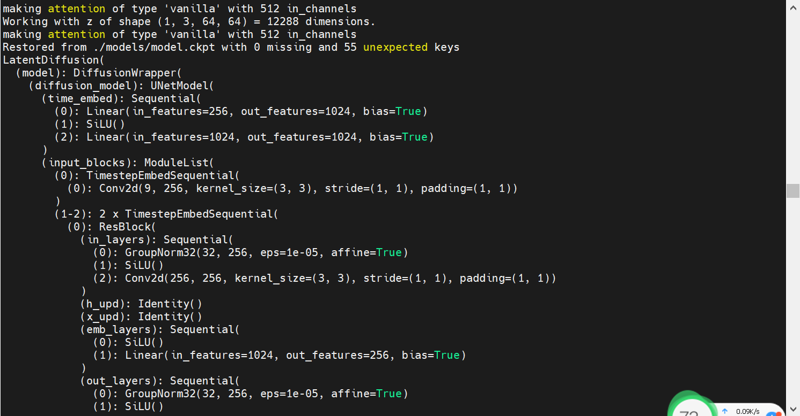
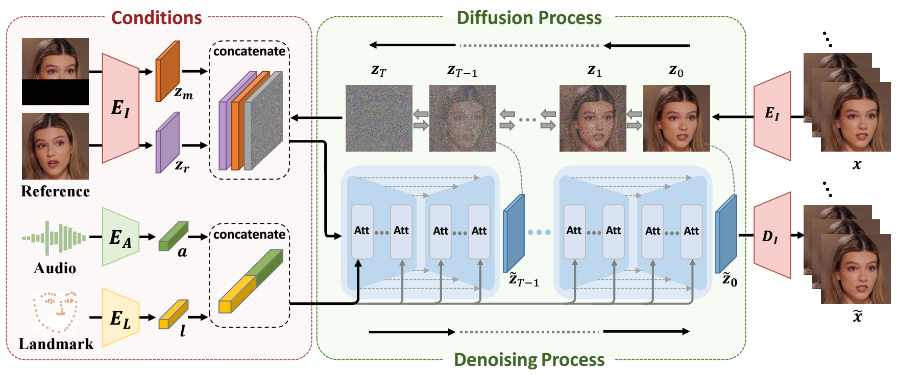
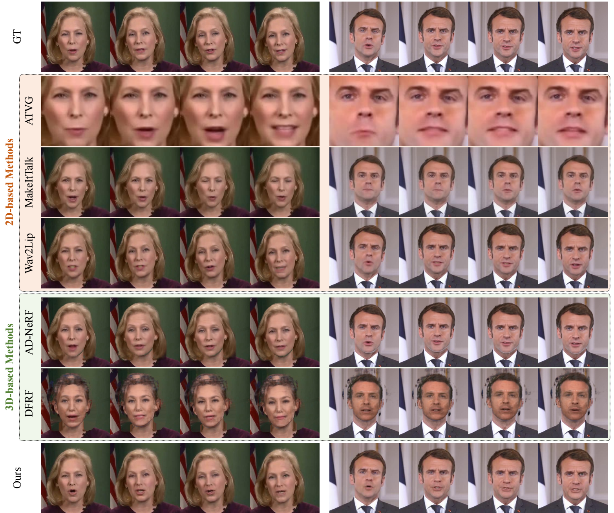

# DiffTalk #
The pytorch implementation for "DiffTalk: Crafting Diffusion Models for Generalized Audio-Driven Portraits Animation".
Incorporated in this framework by Huanran Chen.

## Extra requirements for training and inference
training:
- pytorch-lightning 1.2.5 (Also required for loading models)

testing:
- configargparse
- Omegaconf
- taming-transformers. https://blog.csdn.net/qq_45560230/article/details/134936234. Need to replace one file after installation.
For more details, please refer to the `requirements.txt`. 

Requires 8 NVIDIA 3090Ti GPUs.

Put the first stage [model](https://cloud.tsinghua.edu.cn/f/7eb11fc208144ed0ad20/?dl=1) to `./models`.

** Remember to run the model at the root of taking-face.

## Model
Obviously its impossible to push the checkpoint to github.

Please download the checkpoint from here: https://cloud.tsinghua.edu.cn/f/7eb11fc208144ed0ad20/?dl=1

Please do not modify the checkpoint name. Keep it as "model.ckpt".

Put it into "./checkpoints/DiffTalk"


## Dataset
Please download the HDTF dataset for training and test, and process the dataset as following.

**Data Preprocessing:**


1. Set all videos to 25 fps.
2. Extract the audio signals and facial landmarks.
3. Put the processed data in `./data/HDTF`, and construct the data directory as following.
4. Constract the `data_train.txt` and `data_test.txt` as following.

./data/HDTF:

    |——data/HDTF
       |——images
          |——0_0.jpg
          |——0_1.jpg
          |——...
          |——N_M.bin
       |——landmarks
          |——0_0.lmd
          |——0_1.lmd
          |——...
          |——N_M.lms
       |——audio_smooth
          |——0_0.npy
          |——0_1.npy
          |——...
          |——N_M.npy

./data/data_train(test).txt:

    0_0
    0_1
    0_2
    ...
    N_M


N is the total number of classes, and M is the class size.


## Training
It requires 8 GPUs to train. We are impossible to train this, but we implement the trainer, and you can use our code to train it.
```
CUDA_VISIBLE_DEVICES=0,1,2,3,4,5,6,7 python ./trainer/DiffTalkTrainer.py --base ./model/image_driven_talkingface/DiffTalk/configs/latent-diffusion/talking.yaml -t --gpus 0,1,2,3,4,5,6,7,
```

## Test
I have already incorporated the model into this framework. You can directly initialize the model from the top API.

**I also write a small demo, see "demo.py" in this directory.** You need to copy it into the root and provide it data, then you can directly run it.

## Weakness
1. The DiffTalk models talking head generation as an iterative denoising process, which needs more time to synthesize a frame compared with most GAN-based approaches. This is also a common problem of LDM-based works.
2. The model is trained on the HDTF dataset, and it sometimes fails on some identities from other datasets.
3. When driving a portrait with more challenging cross-identity audio, the audio-lip synchronization of the synthesized video is slightly inferior to the ones under self-driven setting.
4. During inference, the network is also sensitive to the mask shape in z_T , where the mask needs to cover the mouth region completely and its shape cannot leak any
lip shape information.

## Pictures
For training, it requires 8 GPUs to train. We are impossible to train this, but we implement the trainer, and you can use our code to train it.
For testing, its very easy to initialize the model:
write some thing at the root of this project, just:
```python
from talkingface.model.image_driven_talkingface.DiffTalk import get_difftalk_inference

model = get_difftalk_inference()

print(model)
```
Or just Call the API. You can see the loaded model:


## Paper
The paper "DiffTalk: Crafting Diffusion Models for Generalized Audio-Driven Portraits Animation" introduces a novel method for synthesizing high-fidelity, audio-driven talking head videos. This method, called DiffTalk, leverages the capabilities of Latent Diffusion Models. It focuses on generating temporally coherent talking head videos by using audio signals, reference face images, and landmarks as conditions. This approach allows for the creation of personalized, synchronized talking videos without the need for additional fine-tuning, even for different identities. The paper also demonstrates the method's ability to be adapted for higher-resolution synthesis without significant computational cost. Extensive experiments validate the effectiveness of DiffTalk in synthesizing high-quality talking head videos for a wide range of identities.

An overview of the DiffTalk is shown in the follwing figure.


The visualization results are shown in the follwing figure.


## Acknowledgement
This code is built on https://github.com/sstzal/DiffTalk

